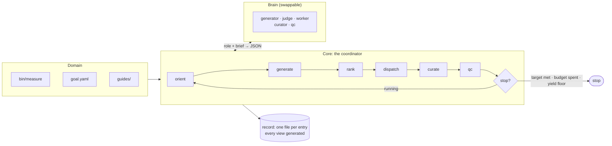

# autoresearch

A domain-agnostic harness for running autonomous research loops: typed goals,
structured hypothesis state, ranked selection, a coordinator that dispatches
parallel workers, and budgets that actually stop things.

It is extracted from a harness that drove **271 hypotheses to 257 verdicts in
eight days** on one problem, and — more usefully — filed **143 defects against
itself** in the same period, with dates and evidence. Those defects are the
design input. `docs/EVALUATION.md` classifies all of them and says what each one
becomes here.

## The idea

A research loop needs four things a chat session does not have: somewhere to put
a verdict so the next agent does not repeat the work, a way to decide what is
worth doing next, a way to know whether it is winning, and a way to stop. This
provides those, and delegates judgement to a model through one narrow seam.

```
orient -> generate -> rank -> dispatch -> curate -> qc -> stop?
```



Every phase is metered. Generation runs *every* iteration, concurrently with the
work, so the queue never starves. Ranking is a formula over recorded numbers that
a judge may reorder but not overrule. Workers get isolated workspaces the
coordinator creates and destroys. QC is mechanical first and a model second.

## A domain supplies four things

Everything else is core-owned.

| | |
|---|---|
| **Measurement** | a command that runs one experiment and emits a validated record |
| **Goal** | metrics, an objective over them, a possibly-moving target, derived constants |
| **Policy** | forbidden paths, never-push remotes, human-only commands, a spend ceiling — as data |
| **Knowledge** | the guides agents read to form good hypotheses |

```toml
# domain.toml
[domain]
name = "toy"
goal = "goal.yaml"

[[tracks]]
id = "research"
prefix = "Q"
view = "docs/log/Hypothesis Queue.md"

[lanes]
findings = "^(data/runs|inbox|docs|state)/"

[[policy.human_only]]
pattern = "thing submit"
reason  = "irreversible and public; an agent may prepare it, never run it"

[budgets]
claim_max_runs        = 12
iteration_fanout      = 3
domain_max_runs       = 500

[commands]
measure      = "bin/measure"
probe_target = "bin/probe-target"
```

```yaml
# goal.yaml
goal:
  id: beat-frontier
  direction: minimise
  metrics:
    T: {field: T, direction: minimise}
    Q: {field: Q, direction: minimise}
  objective: "round(T) * Q"
  derived:  {break_even: "T / Q"}     # an expression, never a stored number
  target:   {source: bin/probe-target, moving: true}
  stop_when: "objective < target"
  yield_floor: {confirmed_per_iteration: 0.15, over_iterations: 10}
```

## Install

```bash
pip install -e .
ar --domain domains/toy board
```

## Start a new research project

**One repository per project, with this toolkit installed into it as a
dependency.** Do not fork it and do not copy it in. A project owns the four
domain things and nothing else, so a fork has nothing to customise and forfeits
every core fix; and because every document here is generated, an upgrade has
nothing to merge by hand.

```bash
mkdir ~/research/widgets && cd ~/research/widgets && git init
python -m venv .venv && source .venv/bin/activate
pip install "autoresearch @ git+https://github.com/Ryun1/auto-research-toolkit@main"

ar init . --name widgets \
   --objective "round(latency) * memory" --metric latency --metric memory --target 5000
```

`ar init` refuses to scaffold over an existing `domain.toml`, so pointing it at
a fresh repo is safe. What it writes **validates clean and runs before you edit
anything** — a scaffold whose first act is to fail teaches you to ignore the
validator. Then:

1. `bin/measure` — replace `evaluate()` with your real experiment
2. `goal.yaml` — the metrics it returns, and what winning means
3. `guides/landscape.md` — what an agent needs to know to guess well
4. `domain.toml` — `[policy]` never-rules, `[budgets]`, `[hardware]`
5. `ar hardware` — what this machine can and cannot run
6. `ar loop` — go

The domain does not have to live anywhere in particular: `ar` finds the nearest
enclosing `domain.toml`, or takes `--domain`. `domains/toy` sits inside this
repository only because it is the fixture the tests run the whole loop against.

### Why its own repository

- **Workers get real isolation.** The workspace pool cuts a git worktree per
  slot when the domain root is a git repository, and falls back to copying the
  tree when it is not.
- **The corpus is the project.** `state/`, `data/runs/` and `inbox/` accumulate
  under the domain root, and the `[lanes] findings` regex is anchored there.
  Those records are the thing being built; they belong in the project's history.

### Two decisions worth making on day one

**Pin the toolkit, in the project.** A run record's `provenance` carries the
host, the interpreter and a hash of `bin/measure` — not the core version. So if
ranking or closure semantics move under you mid-project, nothing in the corpus
says which core produced which decision. Replace the `@main` above with a tag or
a commit SHA, or commit a lockfile, and bump deliberately. An editable install
against a local checkout is fine while the two are developed together — then the
pin is a SHA the project records.

**Commit `state/` and `data/runs/`.** Gitignore `.venv`, `__pycache__` and the
workspace pool (`.ar/`) — not the records. A confirmed result that lived only in an
ignored checkout, and so could not be reproduced, is one of the defects in
`docs/EVALUATION.md` (H39) that this layout exists to prevent.

### Where a change belongs

If you want to change something that is not one of the four domain-owned files —
a new closure kind, the ranking formula, a brain, a role prompt — that is a core
change and belongs upstream on the `H` track. Patching it into the project is
the fork, arriving one increment at a time.

## Commands

```
ar init        scaffold a new domain that is valid and runnable before you edit it
ar hardware    what this machine is, what it can run, and what it cannot
ar board       one screen: goal, distance to target, queues, live claims, measurements
ar rank        score the queue and show the numbers it ranked on
ar budget      every meter, and the stop decision
ar loop        run the coordinator until it stops
ar entry       file, show and list entries
ar claim       take one entry (serialised, always with a ceiling)
ar release     hand a claim back, with a reason
ar reap        free ONE abandoned claim past the TTL
ar close       close, reopen, or relabel a closure
ar measure     run the domain's measurement and record the row
ar migrate     convert an existing prose corpus into records (one way)
ar render      write the generated queue views
ar validate    check records, views, runs and policy
ar policy      show the never-rules and prove each refuses something
```

## Hardware awareness

The harness inspects the machine it is on, records it, refuses work it cannot
do, and says when to stop buying local time.

```
$ ar hardware
chip        Apple M2  [apple arm64]
cpu         8 threads (4P + 4E)
memory      16.0 GB (6.0 GB available)
gpu         Apple M2, 10 cores, 16 GB unified
power       battery  ** sustained throughput will be lower **
note        unified memory: the GPU competes with the CPU for the same pool

  OK   gpu-walk-full        (memory allows 323-way concurrency)
```

Three things make this more than a `uname` wrapper:

- **Capacity is a refusal, not a truncation.** A domain declares what an
  experiment class needs (`base_memory_gb`, `gb_per_unit`, `needs_gpu`), and an
  entry naming a class the host fails is excluded from ranking *before* it is
  claimed. A run that silently caps its concurrency reports a throughput for a
  configuration nobody chose — and a figure produced that way was published and
  later retired in the corpus this came from.
- **A rate is never a property of hardware alone.** `Throughput` cannot be
  constructed without naming its machine *and* its concurrency, and
  `ratio_to()` refuses to divide two figures taken at different concurrencies
  unless you say so explicitly. That comparison is exactly how the retired
  figure was produced.
- **Apple Silicon specifics are first-class**: P/E core split, unified memory
  (GPU concurrency is bounded by total RAM, not a separate VRAM budget),
  battery vs AC, and thermal throttling — a figure taken while throttled is a
  lower bound, not a measurement.

### When local hardware is not enough

`escalate` recommends rented compute, under two gates borrowed from a guide that
was written after renting on a hunch had already cost money:

- **Gate 0 — the work is already correct locally.** Asserted by the domain, never
  inferred. A rented hour spent finding a port bug buys nothing.
- **Gate A — the budget reaches a rung.** Compute has to change the *answer*, not
  the wall clock. Being 10× faster at something needing 10,000× is not a reason.

And one rule of its own: **core never invents a speedup.** A class with no
measured ratio for this workload cannot be costed — the verdict is
`NEEDS_MEASUREMENT`, not a guess. The same walk measured 0.82× on one GPU and
38.1× on another; nothing about the hardware predicted either.

```
escalation: GO  (trigger: too-slow)
  rent rtx-4090: 2.3 h at $0.40/h = $0.90
  local       2.22 candidates/s @ 8-way on Apple-M2/8t/16g [screen]
  need        200,000 candidates  ->  25.0 h locally
    rtx-4090          2.3 h   $  0.90  [measured 11.10x @ 16384-way, run-abc]
    cpu-32core        8.3 h   $  1.25  [measured 3.00x @ 32-way, run-def]
    h100                —          —   [no measured ratio; not costed]
  Renting spends money, which is a human decision.
```

Note the cheapest per hour is not the cheapest overall — which is why this is
arithmetic and not a rule of thumb. Nothing here spends money.

## The seven invariants

Each comes from a failure class in `docs/EVALUATION.md`, and each has a test.

1. **One record per entry; every document is generated.** A hand-edited view is a
   validation failure, not a divergence found four hours later.
2. **No regex over prose reaches a decision.** Migration is the one exception and
   it is one-way, with a fidelity gate.
3. **Every guard ships a negative test proving it refuses something.** A guard
   whose enforcement can be deleted without a test failing is a comment.
4. **Constants are computed from a typed goal, never stored.** A stale read is an
   error, not a warning.
5. **Liveness is observed, not inferred.** The coordinator owns the pool and
   knows when a worker finished; TTL reaping is the fallback.
6. **Results are returned through a typed interface.** Undeclared output is not
   evidence and cannot back a closure. Records carry `"schema": "ar-run-1"` —
   deliberately not a name a domain is likely to already own, because two
   schemas under one name invites appending a core record into a corpus whose
   validator will reject it.
7. **The state machine is total and every budget is a meter.** No status is
   terminal by omission; no ceiling is free text.

Two conventions are inherited verbatim from the harness this came from, because
they were already right: **reuse the reader that owns the parse**, and **every
reader reports how many things it read** — a board that says "no live claims"
must not be indistinguishable from one that read nothing.

## The closure taxonomy, made operational

A refutation asserts a direction is dead. That assertion has a *scope*, and
saying which is the sharpest idea in the source harness:

| kind | reach | re-open condition |
|---|---|---|
| `mechanism` | holds outside the range measured | a new mechanism |
| `slope` | holds only inside the band measured | **required** — name the band |
| `cell` | a direct point measurement | **required** — the cell moving |

Ranking reads it. A `mechanism` refutation **hard-excludes** any queued entry
sharing its mechanism — that is what stops a fleet re-running work the board
already paid for. A `slope` or `cell` refutation only **penalises**, because it
re-opens outside its band, and excluding it would be exactly the over-claim the
taxonomy exists to prevent.

## Roles

Prompt per role in `src/autoresearch/agents/`, dispatched by the coordinator:
`generator`, `judge`, `worker`, `curator`, `qc`. The brain is swappable —
`SDKBrain` runs them through the Claude Agent SDK; `ScriptedBrain` runs the whole
loop with no model, which is what makes `ar loop` a unit test rather than a bill. `docs/ARCHITECTURE.md` diagrams what each role reads, what it
may return, and where the coordinator refuses it.

## Status

The core is complete and tested (189 tests). Two domains exist: `domains/toy`, a
synthetic problem with an interior optimum, a knob interaction and a validity
gate, used to exercise the loop in seconds; and the ECDSA Fail benchmark, wired
up in its own repository.

Not yet exercised: `SDKBrain` has never made a real API call — it constructs,
packages and is wired to the money ceiling, and that is all. The offline loop is
proven; the model-in-the-loop path is not.

`docs/ARCHITECTURE.md` draws the same picture in more detail: the three
layers, the seven phases, what each role may and may not do, the entry
lifecycle, and the worker pool.

`docs/EVALUATION.md` carries the harness critique this was built from, plus an
appendix on the eleven defects found in the core itself, grouped by *how* each
was caught. None was found by reading the code.
