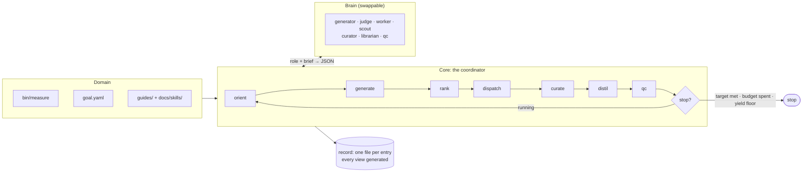

# autoresearch

A domain-agnostic harness for running autonomous research loops: typed goals,
structured hypothesis state, ranked selection, a coordinator that dispatches
parallel workers, and budgets that actually stop things.

It is extracted from a harness that drove **271 hypotheses to 257 verdicts in
eight days** on one problem, and — more usefully — filed **143 defects against
itself** in the same period, with dates and evidence. Those defects are the
design input. `docs/EVALUATION.md` classifies all of them and says what each one
becomes here.

## The idea

A research loop needs four things a chat session does not have: somewhere to put
a verdict so the next agent does not repeat the work, a way to decide what is
worth doing next, a way to know whether it is winning, and a way to stop. This
provides those, and delegates judgement to a model through one narrow seam.

```
orient -> generate -> rank -> dispatch -> curate -> distil -> qc -> stop?
```



Every phase is metered. Generation runs *every* iteration, concurrently with the
work, so the queue never starves. Ranking is a formula over recorded numbers that
a judge may reorder but not overrule, with a configured share of every
shortlist (`risk`) spent on novel branches — entries with no `parent` — so
the loop can still attempt a big swing, and still open a direction it has
never measured. Workers get isolated
workspaces the coordinator creates and destroys. QC is mechanical first and a
model second.

## A domain supplies four things

Everything else is core-owned.

| | |
|---|---|
| **Measurement** | a command that runs one experiment and emits a validated record |
| **Goal** | metrics, an objective over them, a possibly-moving target, derived constants |
| **Policy** | forbidden paths, never-push remotes, human-only commands, a spend ceiling — as data |
| **Knowledge** | the guides agents read to form good hypotheses — and, once work starts closing, the skills the loop distils from it |

```toml
# domain.toml
[domain]
name = "toy"
goal = "goal.yaml"

[[tracks]]
id = "research"
prefix = "Q"
view = "docs/log/Hypothesis Queue.md"

[lanes]
# `state/` is enumerated, never taken whole: state/claims holds a lock whose
# holder and pid mean nothing on another machine.
findings = "^(data/runs|data/artifacts|inbox|docs|state/entries|state/iterations)/"

[[policy.human_only]]
pattern = "thing submit"
reason  = "irreversible and public; an agent may prepare it, never run it"

[budgets]
claim_max_runs        = 12
iteration_fanout      = 3
iteration_max_spawns  = 10
iteration_max_seconds = 3600
domain_max_runs       = 500

[coordinator]
workers_per_iteration = 3
risk                  = 0.5    # share of each shortlist aimed at novel branches (no parent)
tree_max_depth        = 3      # cap on branch lineage depth; 0 disables
tree_max_children     = 4      # cap on siblings per parent; 0 disables
# branch_stagnation   = 3      # a parent with this many refuted children and none
#                              # confirmed is excluded from ranking, and refuses
#                              # new children at filing; 0 disables
# confirm_runs        = 2      # valid run rows a `confirmed` experiment closure
#                              # must leave in the ledger (replication); 1 keeps
#                              # the default contract

[commands]
measure      = "bin/measure"
score        = "bin/score"      # optional: the domain prices its own branches
probe_target = "bin/probe-target"
```

```yaml
# goal.yaml
goal:
  id: beat-frontier
  direction: minimise
  metrics:
    T: {field: T, direction: minimise}
    Q: {field: Q, direction: minimise}
  objective: "round(T) * Q"
  derived:  {break_even: "T / Q"}     # an expression, never a stored number
  target:   {source: bin/probe-target, moving: true}
  stop_when: "objective < target"
  yield_floor: {confirmed_per_iteration: 0.15, over_iterations: 10}
  # Hold a met target until a second, independent run row (different claim:
  # different workspace session or entry) also meets it. AIRA measured the
  # failure this guards at 9-13 points on MLE-bench (arXiv 2507.02554 §5.3):
  # a search guided by its own proxy overfits, and the perceived score keeps
  # rising after the true one has stopped.
  confirm_independently: true
```

Two guards the *coordinator* owns sit on top of the goal, and both are
`[coordinator]` keys rather than goal fields because they gate closures and
ranking, not the stop decision:

- **`confirm_runs`** (default `1` = off): a `confirmed` *experiment closure*
  must leave that many valid run rows in the ledger, counted by row id. The
  refusal is identical on both close paths — the loop's `_apply_verdict` and
  `ar close` — and releases the claim back to the queue; the rows stay
  charged, and the next worker adds the missing one. This is per-entry
  replication and deliberately weaker than the goal's
  `confirm_independently`: that one guards proxy overfitting across claims
  (AIRA arXiv 2507.02554 §5.3); this one guards one noisy or fabricated run
  closing a discovery forever (CodeScientist, arXiv 2503.22708 — discoveries
  that passed paper review died on replication with more samples). Refuted
  verdicts are exempt: a legitimate refutation may hold only `invalid`/
  `failed` rows — a configuration that measured but failed its validity gates
  still decided the bar — so demanding clean rows for a `no` would cry wolf.
- **Faithfulness, mechanical, always on:** at QC, before any model is asked,
  every closed `confirmed` entry's typed `summary` is checked against the
  ledger — each non-trivial number in it must be a metric value of one of the
  entry's run rows, that row's objective value, the row count, or arithmetic
  (difference/ratio) over matched values, else QC's mechanical problems name
  it. The failure is documented, not hypothetical: AgentRxiv's agents
  fabricated plausible results (arXiv 2503.18102), and CodeScientist found
  experiments whose paper claimed a discovery the code never produced. The
  check reads the typed summary, never the memo's free prose — prose parsed
  by regex reaching a decision is failure class 3.2, deleted, not mitigated.

## Install

```bash
pip install -e .
ar --domain domains/toy board
```

## Start a new research project

**One repository per project, with this toolkit installed into it as a
dependency.** Do not fork it and do not copy it in. A project owns the four
domain things and nothing else, so a fork has nothing to customise and forfeits
every core fix; and because every document here is generated, an upgrade has
nothing to merge by hand.

```bash
mkdir ~/research/widgets && cd ~/research/widgets && git init
python -m venv .venv && source .venv/bin/activate
pip install "autoresearch @ git+https://github.com/Ryun1/auto-research-toolkit@main"

ar init . --name widgets \
   --objective "round(latency) * memory" --metric latency --metric memory --target 5000
```

`ar init` refuses to scaffold over an existing `domain.toml` (`--force`
overrides, on a directory you are certain is disposable), so pointing it at a
fresh repo is safe. What it writes **validates clean and runs before you edit
anything** — a scaffold whose first act is to fail teaches you to ignore the
validator. Then:

1. `bin/measure` — replace `evaluate()` with your real experiment
2. `goal.yaml` — the metrics it returns, and what winning means
3. `guides/landscape.md` — what an agent needs to know to guess well
   (`docs/skills/` fills itself in as work closes)
4. `domain.toml` — `[policy]` never-rules, `[budgets]`, `[hardware]`
5. `ar hardware` — what this machine can and cannot run
6. `ar loop` — go

The domain does not have to live anywhere in particular: `ar` finds the nearest
enclosing `domain.toml`, or takes `--domain`. `domains/toy` sits inside this
repository only because it is the fixture the tests run the whole loop against.

The scaffold also writes `AGENTS.md` — the claim → measure → close protocol an
agent opened in a terminal follows to drive the domain by hand. The toolkit's
own docs live in the toolkit repository, which a project does not contain; this
file ships where agents look first.

### Why its own repository

- **Workers get real isolation.** The workspace pool cuts a git worktree per
  slot when the domain root is a git repository, and falls back to copying the
  tree when it is not.
- **The corpus is the project.** `state/`, `data/runs/` and `inbox/` accumulate
  under the domain root, and the `[lanes] findings` regex is anchored there.
  Those records are the thing being built; they belong in the project's history.

### Two decisions worth making on day one

**Pin the toolkit, in the project.** A run record's `provenance` carries the
host, the interpreter and a hash of `bin/measure` — not the core version. So if
ranking or closure semantics move under you mid-project, nothing in the corpus
says which core produced which decision. Replace the `@main` above with a tag or
a commit SHA, or commit a lockfile, and bump deliberately. An editable install
against a local checkout is fine while the two are developed together — then the
pin is a SHA the project records.

**Commit `state/` and `data/runs/`.** Gitignore `.venv`, `__pycache__` and the
workspace pool (`.ar/`) — not the records. A confirmed result that lived only in an
ignored checkout, and so could not be reproduced, is one of the defects in
`docs/EVALUATION.md` (H39) that this layout exists to prevent.

### Where a change belongs

If you want to change something that is not one of the four domain-owned files —
a new closure kind, the ranking formula, a brain, a role prompt — that is a core
change and belongs upstream on the `H` track. Patching it into the project is
the fork, arriving one increment at a time. "Filing defects upstream" below is
the mechanism that makes that a workflow instead of an aspiration.

## Commands

```
ar init        scaffold a new domain that is valid and runnable before you edit it
ar hardware    what this machine is, what it can run, and what it cannot
ar escalate    whether to rent compute, which class, and the arithmetic
ar board       one screen: goal, distance to target, queues, live claims, measurements
ar rank        score the queue and show the numbers it ranked on
               (--risk R overrides the domain's novel-branch dial)
ar budget      every meter, and the stop decision
ar loop        run the coordinator until it stops
ar skill       list, find, show, check, distil and retire the domain's skills
ar entry       file, show, amend, reprice and list entries
               (entry graph: the hypothesis tree as a mermaid diagram)
ar claim       take one entry (serialised, always with a ceiling)
ar release     hand a claim back, with a reason
ar reap        free ONE abandoned claim past the TTL
ar close       close, reopen, or relabel a closure
ar measure     run the domain's measurement and record the row
ar research    spin up targeted research agents; their ideas land in the record
ar harness     check for and pull the latest core; export defects upstream
ar doctor      which core answered, and whether it meets the domain's floor
ar migrate     convert an existing prose corpus into records (one way)
ar render      write the generated queue views
ar validate    check records, views, runs and policy
ar policy      show the never-rules and prove each refuses something
ar exec         reserve and run one bounded local command under a live claim
ar attempt      execution ledger: list, show, checkpoint, reconcile
ar external     assign work to an external coordinator, settle or cancel it
ar challenge    the public challenge's shared intel: pull, show, check, target
ar usage        record, list and price out-of-band spend
ar gates        per-entry acceptance gates: configure, update, show
ar evidence     portable integrity-only evidence bundles: pack, verify, import
ar relocate     move oversized inbox evidence into the findings lane, rewriting every recorded pointer
ar workspace    inspect or archive an abandoned workspace slot
ar session      persistent worktree sessions for hand-driven work: create, destroy, prune
```

The installed `autoresearch` command avoids the system `ar` archiver name
collision. New domains also receive `bin/autoresearch`, bound to the Python
interpreter used to initialize them — and `bin/ar`, a shim that probes
`.venv312/` and `.venv/` for the toolkit CLI and execs it, falling through to
`python3 -m autoresearch`. That shim exists because bare `ar` on macOS is
`/usr/bin/ar`, the BSD archiver: it runs plausibly instead of failing, which
is worse (field defect H149, fixed once in the field and now scaffolded for
every new domain).

`ar migrate` is an import, not an update: existing entry IDs and duplicate IDs
across selected sources are refused before any entries are written. `--dry-run`
performs the same collision checks. Resolve collisions in the source corpus;
use `ar entry amend` for deliberate changes to existing records.

**A hand-driven agent should not parse prose it only needs to route on.**
`ar rank`, `ar budget`, `ar validate` and `ar entry list` each take `--json`
(the whole document, nothing else, on stdout; exit codes unchanged), and
`ar entry show` defaults to current state — pass `--history` for the full
append-only record. Every verb that saves an entry record re-renders the
generated views itself, so `mutate → validate` no longer needs an `ar render`
in between. `ar skill find <terms>` routes on descriptions the same way a
brief does, without reading the whole index. The coordinator's own asks moved
the same direction: briefs are role-scoped (the worker gets its entry, the
generator the whole board) and compact, so a payload that once grew with the
record now grows only for the roles that read it.

**The record draws its own map.** A track that declares `graph_view = "docs/log/Hypothesis
Graph.md"` gets a second generated view: the hypothesis tree as a mermaid
flowchart — branch lineage, supersessions, related work, nodes coloured by
status — which Obsidian, GitHub or any mermaid renderer displays as a
clickable picture. Wide corpora are handled: entries no edge touches are
grouped into status-labelled buckets instead of one endless row of loose
nodes. Like every view it is generated from the records, so
agents never maintain a diagram beside the record that would drift from it;
`ar entry graph` prints the same markdown (paste it into a memo), and
`ar entry graph --html PATH` writes a standalone browser snapshot in which
hovering a node shows the full title and the entry's summary — a closure's
verdict summary, or the hypothesis claim for an entry with no verdict yet.
A diagram
of the agent's own — a mechanism sketch, a decision tree — is a ```mermaid
fence in an entry body or a memo: markdown renders it, and nothing parses
markdown back, so a picture cannot become a second source of truth.

**Which verdicts are terminal is per-track config.** The default machine closes
research on `confirmed`/`refuted`; a defect track closes on `fixed`/`wontfix`
— so `ar close H2 confirmed` is a legal move that leaves the entry actionable
and returning to the queue. The first real domain filed a harness defect with
the research-track verb and learned the rule only by watching the entry
bounce. `ar close` now warns at the moment it happens, naming the track's
terminal set; `ar entry reprice` corrects filing-time confidence/impact/cost
on an open entry with the same writer (and the same H140 guard) the loop's
curator phase uses, because a hand-driven curator pass once had no path
except editing the YAML.

**A closure names its evidence class.** The mechanical faithfulness check — a
confirmed experiment's typed summary must trace to the run ledger — assumes
the evidence is a local measurement. Two legitimate kinds are not: `official`
results carry evaluator-owned numbers measured on an external pinned host,
and `census` results are deliberately measurement-free (differential tests,
asm censuses, policy readings). `ar close --evidence-class census` declares
the class at closure, and `ar entry amend --evidence-class` reclassifies a
closure the strictness predates — one typed field, the verdict untouched,
`--why` mandatory, the change appended to history. A `ledger` closure (the
default) keeps the full fabrication net, and the net reads a second evidence
pool: the `run_detail` legs a settled external report retains, so a scratch
bench's confirmed summary must still trace every figure to evidence the
record holds (pvfast-stwo-simd H10/H11).

**Oversized inbox evidence moves with its pointers.** `ar validate` warns on
every inbox file past 64 KiB that terminal evidence belongs in
`data/artifacts/`; a bare `mv` dangles the memos and sources that cite it.
`ar relocate inbox/<file>` performs the whole surgery: every refusal checked
up front (destination exists, destination still inside the inbox, source
outside the inbox, destination outside the domain root, missing reason),
then the move, then every recorded pointer rewritten — including closed
entries' `result.memo` — through the atomic record save with a history
event, then the views re-rendered, so `validate` follows clean (QSB H32).

**The installed core is part of the environment the records trust.** A copied
(non-editable) install lags its checkout silently, and a stale install
resurrects fixed defects — the first field domain verified its install by
hand, md5 against the checkout, and pinned reopen conditions to "reinstall ≥
the fix commit" in prose. Declare a floor instead:

```toml
[upstream]
url      = "https://github.com/Ryun1/auto-research-toolkit"
ref      = "main"
min_core = "0.2.0"   # refuse to run on an install older than the fixes cited
```

`ar doctor` reports which core, interpreter and module answered (read-only;
non-zero exit when a check fails, so a schedule can watch it), and `ar
validate` names a stale core as a warning — never a failure, per that
command's contract.

## The public challenge's shared intel

Auto-research domains are usually one entry in a public challenge with a
leaderboard and a bulletin. That shared state — the published record, the
measurement contract other solvers' rates were taken under, the research graph
of what was already tried and refuted — is domain input, and it is the same
input for every challenge-chasing domain, so core reads it once:

```toml
[challenge]
source          = "provablyfast"   # or "yukon"
url             = "https://provably.fast/data/index.json"   # optional override
refresh_seconds = 1800
```

```
ar challenge pull     fetch-if-stale, normalize, cache under state/challenge/
ar challenge show     render the cached snapshot (no network)
ar challenge check    compare the published policy against this host and [policy]
ar challenge target   print the target number, one line (fetch-if-stale)
```

It splits on the harness's two enforcement classes:

- **Enforced.** The published record *is* the moving target. `bin/probe-target`
  can be one line — `exec ar challenge target` — and `Target.resolve`'s own
  TTL governs the cadence. `stop_when` keeps its meaning: "met" is met against
  the *current* record, not the number someone hand-copied last week. There is
  deliberately no second refresh path: the loop itself never fetches, and
  `orient` reads the cache only.
- **Advisory.** The record, the top-of-board saturation, and the source's own
  truth label ride into the generator, judge and scout briefs as a
  role-gated `challenge` block — never into the record. External verdicts
  would pollute `mechanism_coverage`, the yield floor and the meters with
  work this campaign never paid for.

`ar challenge check` makes comparability loud instead of assumed: a host whose
fingerprint disagrees with the published one, a `[policy]` that does not cover
the challenge's forbidden paths, or a stale snapshot are exit-1 findings —
because two rates measured on different machines are not comparable without
saying so, and a rejected submission is the expensive way to learn your
policy was incomplete.

Submission is never automated: it is irreversible and public, which is exactly
what `[[policy.human_only]]` is for.

## Hardware awareness

The harness inspects the machine it is on, records it, refuses work it cannot
do, and says when to stop buying local time.

```
$ ar --domain domains/toy hardware
host        puffin.local
chip        Apple M2  [apple arm64]
cpu         8 threads (4P + 4E)
memory      16.0 GB (5.3 GB available)
gpu         Apple M2, 10 cores, 16 GB unified
power       battery  ** sustained throughput will be lower **
note        unified memory: the GPU competes with the CPU for the same pool, so GPU concurrency is bounded by total RAM, not by a separate VRAM budget

requirements declared: 2
  OK   cheap-sweep on Apple-M2/8t/16g
  OK   wide-sweep on Apple-M2/8t/16g  (memory allows 524-way concurrency)

rentable classes declared: 2
  toy-cpu-16core         $0.35/h   2.50x @ 8-way   toy calibration, 2026-08-31
  toy-gpu-unmeasured     $0.90/h   NO MEASURED RATIO — cannot be costed, and a spec sheet is not a measurement
```

Three things make this more than a `uname` wrapper:

- **Capacity is a refusal, not a truncation.** A domain declares what an
  experiment class needs (`base_memory_gb`, `gb_per_unit`, `needs_gpu`), and an
  entry naming a class the host fails is excluded from ranking *before* it is
  claimed. A run that silently caps its concurrency reports a throughput for a
  configuration nobody chose — and a figure produced that way was published and
  later retired in the corpus this came from.
- **A rate is never a property of hardware alone.** `Throughput` cannot be
  constructed without naming its machine *and* its concurrency, and
  `ratio_to()` refuses to divide two figures taken at different concurrencies
  unless you say so explicitly. That comparison is exactly how the retired
  figure was produced.
- **Apple Silicon specifics are first-class**: P/E core split, unified memory
  (GPU concurrency is bounded by total RAM, not a separate VRAM budget),
  battery vs AC, and thermal throttling — a figure taken while throttled is a
  lower bound, not a measurement.

### When local hardware is not enough

`escalate` recommends rented compute, under two gates borrowed from a guide that
was written after renting on a hunch had already cost money:

- **Gate 0 — the work is already correct locally.** Asserted by the domain, never
  inferred. A rented hour spent finding a port bug buys nothing.
- **Gate A — the budget reaches a rung.** Compute has to change the *answer*, not
  the wall clock. Being 10× faster at something needing 10,000× is not a reason.

And one rule of its own: **core never invents a speedup.** A class with no
measured ratio for this workload cannot be costed — the verdict is
`NEEDS_MEASUREMENT`, not a guess. The same walk measured 0.82× on one GPU and
38.1× on another; nothing about the hardware predicted either.

Core supplies every input it can know — the host, the declared hardware classes,
the rentable classes and their measured ratios, the spend ceiling. The four it
cannot are flags, because none of them has an honest source here: how fast this
workload runs locally, how many units it needs, how long the answer stays worth
having, and whether the work is already correct.

```
$ ar --domain domains/toy escalate --need 200000 --rate 2.22 --unit candidates \
     --concurrency 8 --workload screen --hours-available 24 --correct-locally
host        Apple-M2/8t/16g
escalation: GO  (trigger: too-slow)
  rent toy-cpu-16core: 10.0 h at $0.35/h = $3.50
  local       2.22 candidates/s @ 8-way on Apple-M2/8t/16g [screen]
  need        200,000 candidates  ->  25.0 h locally
  available   24.0 h before this stops mattering
    toy-cpu-16core             10.0 h   $     3.50  [measured 2.50x @ 8-way, toy calibration, 2026-08-31]
    toy-gpu-unmeasured            —            —  [no measured ratio for this workload; not costed]
  Renting spends money, which is a human decision. This is a recommendation with its arithmetic, not an action.
```

The second class is the one to look at: it has a price, a plausible spec and no
measured ratio *for this workload*, so it is listed and not costed. With more
classes declared the ordering matters too — the cheapest per hour is routinely
not the cheapest overall, which is why this is arithmetic and not a rule of
thumb. `GO` and `NOT_TRIGGERED` exit 0; `REFUSE` and `NEEDS_MEASUREMENT` exit 1,
each naming something that has to happen before money is worth spending. Nothing
here spends money.

## Working across two machines

The loop's coordination primitives are single-filesystem: the claim lock is an
`O_CREAT|O_EXCL` file, the TTL is local wall-clock, and ids are `max + 1` over
local records. So two machines running *at the same time* is not supported.
Stopping on one and picking the work up on another is, and costs one rule each
way:

- **Stop between iterations.** The coordinator destroys its workspace pool in
  its own `finally` and QC asserts no claim outlived dispatch, so a completed
  iteration leaves nothing held. Commit `state/entries`, `state/iterations`,
  `data/runs`, `inbox` and `docs/log`; pull before you resume.
- **`state/claims/` and `.ar/` never travel**, and the scaffold's `.gitignore`
  and lane boundary both say so. A committed lock names a holder and a pid that
  mean nothing on the other machine — H32 reintroduced by other means — and the
  workspace markers record absolute paths that are not there.
- **Use one session name across both machines.** Claims, releases and the
  run-file name all key off `--session`, and those are equality checks: under
  one name the second machine can release or close what the first left behind,
  which is otherwise refused outright. (Run them concurrently under one name and
  those same checks pass when they should refuse — which is why the two rules
  are a pair.)
- **After a crash**, `ar reap --ttl-hours 0 <id>` frees a claim whose holder is gone.
  A workspace slot left behind by a dead session is cleared with `ar workspace
  inspect NAME` and then `ar workspace recover NAME --holder <holder> --token <token>
  --confirm-inactive`: the inspect step returns a receipt with a recovery token, the
  recover step archives the slot (evidence included) under `.ar/workspaces/recovered/`
  instead of deleting it, and refuses to act unless you confirm the holder is inactive
  (H15). Workspace operation locks release on process death. If recovery itself
  is interrupted, retry refuses and names the original archive and receipt;
  an operator must reconcile that transaction before reusing the slot. It does
  not create a second empty archive or silently delete the retained evidence.
  Bulk branch deletion is not recovery, and a memo backing a closure still has
  to live under the domain root.

Iteration records are read back at startup, so numbering continues and the
`yield_floor` stop keeps its window across the handoff. Reusing a recorded
iteration number is refused before any phase runs.

## The seven invariants

Each comes from a failure class in `docs/EVALUATION.md`, and each has a test.

1. **One record per entry; every document is generated.** A hand-edited view is a
   validation failure, not a divergence found four hours later. **One declared
   exception:** a *skill* is model prose and cannot be byte-identical to a
   re-render, so it is a third category — cited-and-checked prose. Its
   compensating control is that every claim names the entry behind it and
   validation fails the moment that entry is reopened or relabelled. An
   undeclared exception to an invariant is the "declared and never wired" class
   this document indicts; this one is declared, and `tests/test_skills.py` is
   where it is wired.
2. **No regex over prose reaches a decision.** Migration is the one exception and
   it is one-way, with a fidelity gate.
3. **Every guard ships a negative test proving it refuses something.** A guard
   whose enforcement can be deleted without a test failing is a comment.
4. **Constants are computed from a typed goal, never stored.** A stale read is an
   error, not a warning.
5. **Liveness is observed, not inferred.** The coordinator owns the pool and
   knows when a worker finished; TTL reaping is the fallback.
6. **Results are returned through a typed interface.** Undeclared output is not
   evidence and cannot back a closure. Records carry `"schema": "ar-run-1"` —
   deliberately not a name a domain is likely to already own, because two
   schemas under one name invites appending a core record into a corpus whose
   validator will reject it.
7. **The state machine is total and every budget is a meter.** No status is
   terminal by omission; no ceiling is free text.

Two conventions are inherited verbatim from the harness this came from, because
they were already right: **reuse the reader that owns the parse**, and **every
reader reports how many things it read** — a board that says "no live claims"
must not be indistinguishable from one that read nothing.

## Skills: what the loop learns, not just what it decided

A verdict is a record. A *skill* is what the next agent should have known before
it started, and the two are not the same artefact. The corpus this core came
from grew thirteen hand-written guides — 2,730 lines — at which point "read the
guides" is either a full-corpus read in every brief or a guess, and it grew a
separate tool whose only job was failing the build when a guide quoted a number
the record had since moved. Both mechanisms are core now, per project.

```markdown
---
name: width-validity-gate
description: "Use when a proposal touches `width` or a run comes back unscored:
  'invalid', validity gate, rows that vanish from a sweep."
cites: [Q7, Q12]
distilled: {iteration: 14, at: 2026-08-31T09:12:04Z, core: 0.1.0}
---

# Width below 16 does not trade — it deletes the run

Below 16 the run is `invalid` and does not score [Q7]. It is a gate, not a knob:
there is no band in which paying width buys operations back [Q12].
```

**The description is the routing layer, and it is the whole efficiency
argument.** Every brief carries the descriptions and the paths, never the
bodies, so a role matches two lines and reads the one skill that applies.
`ar skill list` prints both numbers — body lines held against index lines
carried — because that ratio is an observation to check, not a claim to make.

**A citation that moves invalidates the skill.** `cites` must name terminal
entries; reopen or relabel one and `ar validate`, `ar skill check` and the
loop's own QC phase all fail until the skill is re-distilled or retired. That is
measured from `distilled.at`, which is therefore required — a skill with no
timestamp has no "since", and every staleness check would pass by never running. A skill
that outlived its evidence is worse than no skill, because it is confidently
wrong. The same check refuses a skill that quotes a derived constant the goal no
longer computes — invariant 4, applied to prose.

**`distil` is a phase.** It runs after `curate` on a `distil_every` cadence, so
QC checks in the same iteration what the librarian just wrote. The librarian is
read-only and returns a body; the coordinator validates it against the store and
writes it, because a role does not certify its own output. A skill citing an
open entry is refused with its reason on the iteration record rather than
landing and failing validation later. `ar skill distil` runs the same phase by
hand — writing its own `out-of-band` iteration record, so the librarian's spend
reaches the campaign money ceiling without counting as a sample of what the
queue yields — and `--dry-run` shows what is left to distil without spending
anything.

`docs/skills/` and not `guides/` for one reason: the shipped `[lanes] findings`
regex matches `docs/` and not `guides/`, so distilling into `guides/` would put
a scaffolding-lane file on every branch that also carries findings, and a mixed
branch is refused (H51). A distilled skill is derived from findings and
publishes with them; hand-written guides stay where they are.

## Filing defects upstream: the field-to-core loop

Agents running this harness find defects in it constantly — the QC role files
harness debt every iteration. The design question is how that reaches the core
without anybody patching the installed package, and the answer reuses what the
record already does well.

**A defect is an entry, and it must be reproducible.** The scaffold's harness
track declares `requires_defect_evidence = true`, so every `H` entry must carry
three fields:

| field | what it says |
|---|---|
| `core` | which core was running when the defect was observed. Run provenance deliberately omits the core version — a run is reproducible from the record alone. A defect is the opposite case: nobody upstream can reproduce what the reporter saw without it. The loop stamps it automatically, because the reporter is the one place the running version is known for certain. |
| `repro` | a command, or a path relative to the domain root, that demonstrates the defect |
| `observed` | what actually happened; `expected` records what should have |

`ar validate` refuses an `H` entry missing any of them, and every refusal names
the field. A defect nobody can reproduce is an opinion, not a record — and the
class of defect that is "declared and never wired" is precisely the one a test
suite passes while the thing is broken. `ar entry amend` is the completion path
for a defect the QC role spotted but could not fully evidence.

**Export validates; publishing is human-only.** `ar harness export` collects
every open defect carrying its evidence into one JSON bundle
(`ar-defect-bundle-1`), counting what it read, exported, refused and skipped.
An incomplete defect is refused by name and the command exits 1, so a script
cannot mistake a partial bundle for a clean one. The scaffold ships a
`[[policy.human_only]]` rule for `gh issue create`: an agent prepares the bundle
and the issue body and hands both to a person. Filing upstream is public and
irreversible, which puts it in the same category as every other outward-facing
action this harness gates.

**Upstream, a bundle becomes ordinary entries.** The receiving side is
`scripts/ingest-defects.py`: each defect lands as an entry tagged
`from:<project>/<id>`, so re-ingesting a bundle files nothing twice, and a
defect that arrived without its evidence is skipped with the missing field
named — ingest trusts nothing it did not validate itself.

```sh
python scripts/ingest-defects.py bundle.json \
  --into /path/to/receiving-domain/state/entries --track field --prefix F
```

The script discovers `domain.toml` enclosing `--into`, which must be that
domain's configured entry store. `--track` selects a declared track and
`--prefix` must match it; the defaults are `field` and `F`. A missing or invalid
domain, unknown track, wrong store, or mismatched prefix is refused before any
entry is written. Imported entries use the receiving track's initial status
(for example, `triage`), not the source status or an assumed `queued`.
Python callers likewise pass the configured track explicitly:
`ingest_bundle(bundle, store, track=config.tracks["field"])`.

**The loop closes when the pin moves.** A field defect fixed upstream is fixed
downstream by bumping the project's pin to the fixing SHA — the
deliberate-upgrade decision "Pin the toolkit" asks you to make — and closing
the local entry with the core version as its evidence. Nothing is closed
because an issue somewhere said so.

While a defect is open, what an agent may do locally is mitigate through the
four domain-owned surfaces — guides, skills, `[policy]`, `[budgets]` — and
nothing else. Every other workaround is the fork wearing a smaller hat.

## Pulling improvements: updating the core

The other half of the loop: fixes made upstream have to be easy enough to take
that "bump deliberately" actually happens instead of decaying into "pin
forever, drift silently."

**Upgrading from 0.1.x to 0.2.0 is a breaking release for `domain.toml`** —
the ranking reserves were replaced by the tree and the risk dial, and a
domain carrying the old keys forward is refused at load. Read
[docs/MIGRATION.md](docs/MIGRATION.md) before taking the update; the
one-line version is: delete `explore_fraction`/`coverage_fraction`, set
`[coordinator] risk = 0.5` (or your stance), and everything else is
additive.

```
$ ar harness check
installed   core 0.1.0 (editable from ~/auto-research-toolkit) @ fb9f8166a0e2
upstream    https://github.com/Ryun1/auto-research-toolkit  main @ 0c35928c41e2
update available

what changed:
  0c35928 Contributing: guidelines, git hooks, CI, and lint config
  fb9f816 Brain: any agent is a command, and scouts file targeted research

take it with: ar harness update
```

`check` is read-only, safe on a schedule, and machine-readable: exit 0 up to
date, 1 update available, and anything else means the comparison itself failed.
It compares the installed commit — read from pip's own install record, or the
checkout's HEAD for an editable install — against upstream, and shows the
commits between them.

`update` takes it, and is safe to automate because it can undo itself:

1. it pins to the **resolved head SHA**, never a moving ref name — what lands
   is what was checked;
2. it re-renders the views **before** validating, because a new core may render
   differently and a stale view must not read as a broken upgrade;
3. it rolls back **only when validation found problems that were not there
   before the upgrade**. A project with an incomplete defect entry pre-dating
   the update must still be able to take a core fix; pre-existing problems ride
   along, named;
4. a rollback reinstalls the exact commit the project had and re-renders with
   it, so the project is left precisely as it stood; and
5. a successful upgrade writes a memo into `inbox/` — from-version, to-version,
   the changelog — because an environment change the record does not know about
   is the unrecorded-provenance shape (H39) all over again.

Upgrades are an ordinary pip install, so a domain that wants them human-gated
needs no new mechanism — it declares `[[policy.human_only]] pattern = "pip
install"` and the update path refuses through the same engine that gates every
other irreversible action.

A domain points `[upstream]` at its own fork or mirror when it has one, and
pins `ref` to a tag to make updates opt-in.

## The closure taxonomy, made operational

A refutation asserts a direction is dead. That assertion has a *scope*, and
saying which is the sharpest idea in the source harness:

| kind | reach | re-open condition |
|---|---|---|
| `mechanism` | holds outside the range measured | a new mechanism |
| `slope` | holds only inside the band measured | **required** — name the band |
| `cell` | a direct point measurement | **required** — the cell moving |

Ranking reads it. A `mechanism` refutation **hard-excludes** any queued entry
sharing its mechanism — that is what stops a fleet re-running work the board
already paid for. A `slope` or `cell` refutation only **penalises**, because it
re-opens outside its band, and excluding it would be exactly the over-claim the
taxonomy exists to prevent.

A refutation may declare **applicability** alongside its closure kind:
`baseline` identity, `source_revision`, `workload`, `hardware` and typed scalar
`parameters`. Overlap filtering consults every explicitly scoped dimension, so a
closure measured on one machine, at one upstream revision, or inside one
parameter band does not silently kill a hypothesis scoped elsewhere — and an
explicitly scoped refutation is applied only where its dimensions match. A
closing result also carries a disposition: `experiment` (default),
`superseded`, or `already-shipped`. Non-experiment dispositions are recorded as
supersession facts; they create neither negative calibration nor mechanism
overlap, because "the frontier already shipped it" is not evidence the idea
failed.

## Acceptance gates

An entry may declare **gates**: named, ordered stages (`pending | passed |
failed | blocked`), each optionally required and carrying its evidence paths.
A domain sets required gate names per track (`[[tracks.gates]]`); a closure to
`confirmed`/`fixed` is refused while any required gate is incomplete — so a
Python model passing its algebra cannot be recorded as a GPU-ready result.
`ar gates update <id> <name> --state passed --evidence <path> --why <text>`
records progress; `readiness` is derived (`unconfigured | pending | blocked |
failed | ready`) and rendered on the board and queue. Entries with no gate
definitions close as before but never render as ready.

Gates can also bind the **stop decision**. `goal.yaml` may declare
`required_gates: [kernel-proof]` — names matching the track's gate
definitions — and a measurement that meets the target while a required gate
is unpassed is not a win: the loop keeps running, and the iteration record
says exactly which gate held it open. The field case this answers: a loop
recorded `goal-met` on a measured gas gap while its goal text required a
kernel-checked Correct proof — the record watched itself declare a win the
goal did not allow. Two related fixes rode with it: the stop detail prints
the objective and target at full precision (a `{:,.0f}` format displayed a
0.1 gap as `-0`), and a `stop_when` expression satisfied by a zero-on-zero
measurement is refused unless the goal sets `allow_degenerate_target: true`.

## Ranking: the tree, the risk dial, and the domain's own score

```
score = confidence × impact / cost × staleness × overlap
```

Expected value per unit cost, over numbers already in the record. That is
risk-neutral, and risk-neutral EV/cost is **pure exploitation**: an honest long
shot (confidence 0.10, impact 0.40, cost 8 → 0.005) loses to a safe increment
(0.85, 0.02, 1 → 0.017) by 3.4×, and would need impact above 1.0 — more than the
whole objective — to draw level. Left alone, the loop cannot attempt a big
swing.

**The search is a tree, and the record is the tree.** Every entry is either a
**novel root** (no `parent`) or a **branch** (`parent` names an existing
entry): a child refines, narrows, or re-runs its parent's work with one
premise exchanged — a search step that swaps a part rather than turning a
dial. A failed or inconclusive attempt continues as a child; a new territory
opens as a root. The coordinator owns the structure: an unknown parent, a
lineage deeper than `tree_max_depth`, or more siblings per parent than
`tree_max_children` is refused at filing with a reason, and a branch stays on
its parent's track. Agents file branches through their proposals; humans and
native-dispatch agents file them with `ar entry new --parent Q12 --kind
debug`, through the same gate (`tree.py`) — the two paths cannot diverge. A
branch names its intent with `kind` — `improve`,
`debug`, or `probe` — and the kind scopes its memory the way AIRA measured it
(arXiv 2507.02554 §4.1): a `debug` branch is handed its full ancestral chain
so it never re-undoes a repair its parent already made, while the others see
only their siblings' verdicts, which pushes diversity instead of modecollapse. The generator's brief carries each branchable parent's family
verdicts plus a complexity cue (minimal/moderate/advanced, keyed to the
parent's child count) so the next child's premise is as deep as the family
has actually earned.

**The risk dial splits the shortlist structurally.** `[coordinator] risk`
(default `0.5` — the neutral stance: half the attention on improving the
incumbent, half on pursuing novel branches) declares what share of each
shortlist goes to roots; the rest goes to branches. Within each partition the
score decides; an unfilled share returns to the other partition; a single-slot
iteration (`k=1`) is never spent on a partition. Risk appetite is a domain
decision, which is why it is a domain's to set: a domain chasing a frontier
that moved 22.5% in 18.8 days wants a different one from a domain polishing a
converged number. Both ends are legitimate stances — `0` refines the
incumbent only, `1` opens new territory only. `ar rank --risk R` overrides it
for one look.

**A stalled lineage is pruned, not fed.** `[coordinator] branch_stagnation`
(off by default; `3` is a reasonable first setting): when this many of a
parent's children have closed `refuted` — as experiment dispositions, so a
blocked or inconclusive sibling is not evidence against a direction — and
none has closed `confirmed`, the parent is *stagnant*. Its remaining children
drop out of ranking by a hard filter, and filing a new child of it is refused
at filing, with a reason, through the same gate as the tree caps. The
exclusion is recomputed from the record on every rank, so one confirmed
sibling clears the parent — nothing to store, nothing to un-set. The evidence
for the guard is external: AIDE caps failed repairs with `max_debug_depth`
(arXiv 2502.13138) and ml-Master prunes nodes on improvement stagnation
(arXiv 2506.16499) — compute left on a lineage whose every child refutes is
the same burn in any search shape.

**A domain may own the score itself.** `[commands] score = "bin/score"` hands
the *pricing* of claimable branches to a domain command — the same seam shape
as `bin/measure`. It receives `{"risk": <float>, "entries": [<entry dict>,
...]}` on stdin (claimable candidates only — hard filters have already run)
and must print `{"scores": [{"id", "score", "reason"}]}`, one row per entry.
A nonzero exit, a missing id, or a non-finite score refuses the rank phase
and the iteration dispatches nothing — there is no fallback to the formula a
domain replaced. A multi-objective domain can make its scorer Pareto-aware;
whether the goal is one scalar or a frontier is a domain decision, not core
policy.

Three things neither the dial nor the seam deliberately do:

- **They are not a route past the hard filters.** Both operate among *ranked*
  entries only, so a `mechanism`-refuted direction stays dead however large
  its impact looks.
- **The dial never spends the only slot.** The seam never runs when the dial
  partitioning can be avoided: a queue no larger than the shortlist has
  nothing to split.
- **Both honour a judge's `demote`/`drop`** — `apply_veto` moves the card to
  the tail, which is the tail of its partition, so neither can pick it back.

The judge's brief marks which entries are novel, because a novel pick may sit
low on score *by design* and a judge shown one unlabelled reads the ranking
as broken. The generator's brief carries `mechanism_coverage` — verdicts per
tag — and is instructed to file at least one untested-mechanism probe per
batch; a proposal missing `mechanisms`, `confidence`, `impact` or `cost` is
refused at the door, so the ranking can never silently fall back to defaults
the way the corpus this core was extracted from did (1 mechanism tag on 470
entries, the two largest wins novel mechanism families).

## The brain is a command, not a vendor

Every role is judgement delegated through one seam, and the seam does not know
what an agent is. Every role routes to a backend named in the domain's
`[brain]` table — any agent that can take a prompt and print a reply:

```toml
# domain.toml
[brain]
default = ["pi", "-p"]             # any command; required
judge   = "typesafe"               # the built-in TypeSafe (Jev) brain
curator = ["pi", "-p"]             # any command
scout   = ["bin/my-researcher"]
```

**The built-in brain is fail-closed, because it is the backend that
spends API money.** A domain must name it deliberately —
`[brain] authorize_spend = true` — or the caller must pass
`--allow-paid-brain` to `ar loop`, `ar research` or `ar skill distil`. An
absent `[brain]` table, or a table with role overrides and no `default`,
is a refusal that names the remedy: route the roles to commands. A domain
that routes every role to commands never approaches the meter and needs no
authorization.

**The `typesafe` brain** (`TypeSafeBrain` in `driver/brain.py`) serves roles
through [TypeSafe's](https://docs.typesafe.ai/introduction) System One API:
Jev evaluates typed questions (`choice`, `score`, `noul`) against the brief
as a state and returns structured answers — no text generation, no tools. It
serves exactly the two roles that are pure judgement over a brief the
coordinator already assembled — `judge` (one choice question per top-ranked
entry; answers become the veto list `apply_veto` already polices, with the
probabilities as the recorded justification) and `qc` (one noul question per
mechanical problem, keeping the real ones; it cannot file harness debt, which
needs a repro, so it never does). Every other role refuses at ask time, and
the phase records the refusal. It reads `TYPESAFE_API_KEY` (refusing at
startup without it — a backend the loop cannot call is a loop that cannot
start) and prices its cost from the API's token usage when the table supplies
`typesafe_input_per_mtok` / `typesafe_output_per_mtok`; unpriced, the cost is
unknown and the shared ceiling treats it like any other backend's.

The command contract (`ProcessBrain` in `driver/brain.py`) mirrors the measure
command's: the brief arrives on **stdin**, `{role}`, `{prompt_file}` (the
core-owned role prompt), `{workspace}` and `{cost_file}` are substituted into
argv, the reply is stdout (JSON parsed by the same tolerant reader as every
other role), and the backend *may* write a number into `{cost_file}` to be
metered. A backend that meters nothing does not silently read as free: an
unset `{cost_file}` records `cost_usd: null`, and a finite money ceiling
refuses further spend until the usage is reconciled. Unknown cost is not zero;
known usage below the ceiling may continue. Measured zero remains valid and
costs nothing. Every backend shares one money ceiling, so two spenders
halve it rather than each holding a copy.

**A backend that wedges is a phase failure, not a hang.** `[brain]
timeout_seconds` bounds every ask of every backend in the table — the
subprocess ceiling for commands, the HTTP ceiling for the built-in brain
(3600 by default; `0` disables it). A backend that overruns is killed by
process group, its `{cost_file}` spend is still charged, and the ask
surfaces as a named failure the dispatch phase records, so one wedged
command can no longer freeze the iteration while the wall-clock meter runs.

## Plugins: a declared seam for domain tooling

Domains grow tooling the core has no home for — a GPU dev-loop, an evidence
adaptor, a leaderboard probe. Before now the only route was composing the
toolkit's own parser privately, which is an undeclared seam every domain
re-invents differently. Declare it instead:

```toml
# domain.toml
plugins = ["qsbtools"]
```

Each name is an importable module resolved with the domain root on `sys.path`,
exposing `register_cli(subparsers, config)`. Its subcommands appear on `ar`
and run through the same policy engine, meters and record as every core verb —
because they are written against core functions, not around them. The honest
boundary: the core refuses a plugin that does not declare the contract; it
cannot prove a plugin never bypasses the record, and a plugin that does is
forking by other means.

## Bounded execution and external coordination

Two verbs make an execution budget real rather than declarative:

- **`ar exec`** reserves one attempt *before* launching (fail-closed against
  claim, domain, concurrency and money ceilings), runs it with a timeout and
  captured logs, and settles it as `completed | failed | cancelled |
  interrupted`. Crashes and interrupts consume attempts like any other
  settlement; a restart reads the same ledger, so a ceiling cannot be reset by
  restarting. `ar attempt list/show/checkpoint` inspects the ledger.
- **`ar external assign/complete/cancel/show`** hands one entry's work to an
  external agent — a coding harness's native subagents, for example — with a
  stable assignment identity, an explicit scope and ceiling, and a receipt.
  `complete` settles through the same ownership checks and evidence retention
  as an in-loop worker; `cancel` recovers the assignment and preserves
  unharvested evidence. This is a handoff protocol, not a sandbox: policy
  checking and human-only gates are unchanged, and the coordinator that
  dispatches the work remains responsible for what it dispatches.

### Native dispatch: the loop hands off, native agents do the work

`[coordinator] dispatch = "native"` makes the loop's dispatch phase reserve one
bounded external assignment per shortlisted card — the same claim, run ceiling,
wall clock and workspace a core worker would get — and then stop the iteration
there (`stop: native-handoff`), printing a manifest of what to pick up. No
model runs in the coordinator's process: the surrounding harness runs its own
subagents, which settle each assignment with `ar external complete --report`,
and the next `ar loop` invocation's orient sees the applied verdicts. The
judgement roles (generate, judge, curate, distil, qc) still run through
whatever backend `[brain]` routes them to — route them to commands, or let the
parent file entries and prices itself. This is the answer to a real failure:
the unattended path must never reach for API spend nobody has approved — the
loop refuses to start without an explicitly named brain, and paid backends
stay fail-closed. The full no-coordinator shape — claims, meters,
sessions and plugins for hand-driven work — is documented in
`docs/native-driver.md`.

### Out-of-band spend is metered too: `ar usage`

A spender the brain's cost file never sees — a curator's decision API, a
hand-paid GPU rental — is invisible to a money ceiling, and a ceiling that
cannot see a spender is not a ceiling. `ar usage record --tool jev --kind api
--cost 0.42 --session s --note "why"` appends a row to `state/usage.jsonl`
(committed with the corpus, like every meter), and `ar budget` sums it into
the campaign money ceiling. `--unknown` records spend whose price is not
knowable yet: unknown is never free, and a finite ceiling refuses further
spend until `ar usage reconcile <lineno> --cost N --session s` prices the row
by appending a correction. Rows feed the ceiling, so a malformed row is a named refusal,
never a silent skip.

And one more verb for the execution ledger: `ar attempt reconcile <id>
--charged-runs N --reason ...` archives an attempt record the meter cannot
trust (a legacy-schema row, for instance) behind a tombstone whose digest pins
the preserved bytes. The record's spend is asserted by the operator, never
inferred — truthful zero is a real answer, stated not defaulted — and the
assertion feeds the campaign ceiling exactly as stated. Until reconciled, the
invalid record refuses metered commands by name; `ar attempt list` reports it
instead of dying, because a ledger one legacy row bricks is a ledger nobody
can even enumerate to fix.

## Portable evidence bundles

`ar evidence pack` snapshots exact bytes (explicit paths, a run's declared
outputs, optional source snapshots) into a deterministic ZIP with a SHA-256
manifest; `ar evidence verify` checks archive safety and hashes; `ar evidence
import` validates the whole bundle and atomically retains it under a
content-addressed path, idempotently and without manufacturing run records.
The manifest proves integrity of the bytes it names — never trusted origin,
executed identity, or ranked eligibility.
## Roles

Prompt per role in `src/autoresearch/agents/`, dispatched by the coordinator:
`generator`, `judge`, `worker`, `curator`, `librarian`, `qc`, `scout`. The brain
is swappable -- `TypeSafeBrain` serves `judge` and `qc` through TypeSafe's
System One API (see above), `ProcessBrain` runs them through any command (see
above), and `ScriptedBrain`
runs the whole loop with no model, which is what makes `ar loop` a unit test
rather than a bill. `docs/ARCHITECTURE.md` diagrams what each role reads, what
it may return, and where the coordinator refuses it.

Every agent re-reviews its work before it is shared. A worker's reply carries a
`verification` block — what the agent re-read and re-checked, and what that
re-check changed — and the coordinator refuses a verdict that arrives without
one, releasing the claim back to the queue. The block is stored on the
closure's result, so the record says not only what was claimed but that the
agent that claimed it verified it.

### The scout: research the loop did not ask for

`ar research "<question>" [--count N]` spins up N scouts in parallel, each
briefed with one targeted question plus the whole board (open entries, closed
directions, skills, budget). A scout looks outside the record -- sources,
papers, implementations -- and returns idea proposals, which the coordinator
files as ordinary entries through the same path a generator's take. That means
a scout's idea is priced by the next `ar rank`, claimable by the next `ar loop`,
and subject to the same dedup (H60) and closed-direction rules. A scout that
raised is attributed on the record rather than silently dropped, and each scout
spends the spawn meter, so researchers cannot flood what generators could not.

## Status

The core is complete and tested. Two domains exist: `domains/toy`, a
synthetic problem with an interior optimum, a knob interaction and a validity
gate, used to exercise the loop in seconds; and the ECDSA Fail benchmark, wired
up in its own repository.

Not yet exercised: the librarian's prose quality, which only a real model can
show — the phase, its refusals and its record are covered offline, but nothing
here says whether a model writes a *good* skill. The offline loop is
proven; the model-in-the-loop path is not.

`docs/ARCHITECTURE.md` draws the same picture in more detail: the three
layers, the eight phases, what each role may and may not do, the entry
lifecycle, and the worker pool.

`docs/EVALUATION.md` carries the harness critique this was built from, plus an
appendix on the eighteen defects found in the core itself, grouped by *how* each
was caught: running it against real data, rechecking finished work, independent
review, and auditing a written claim against the code. None was found by reading
the code unprompted — and the seven that a claim audit found were all things
declared and never wired, a class whose test suite passes.
