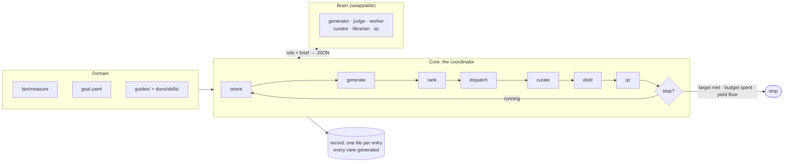

# autoresearch

A domain-agnostic harness for running autonomous research loops: typed goals,
structured hypothesis state, ranked selection, a coordinator that dispatches
parallel workers, and budgets that actually stop things.

It is extracted from a harness that drove **271 hypotheses to 257 verdicts in
eight days** on one problem, and — more usefully — filed **143 defects against
itself** in the same period, with dates and evidence. Those defects are the
design input. `docs/EVALUATION.md` classifies all of them and says what each one
becomes here.

## The idea

A research loop needs four things a chat session does not have: somewhere to put
a verdict so the next agent does not repeat the work, a way to decide what is
worth doing next, a way to know whether it is winning, and a way to stop. This
provides those, and delegates judgement to a model through one narrow seam.

```
orient -> generate -> rank -> dispatch -> curate -> distil -> qc -> stop?
```



Every phase is metered. Generation runs *every* iteration, concurrently with the
work, so the queue never starves. Ranking is a formula over recorded numbers that
a judge may reorder but not overrule, with a share of every shortlist reserved
for amplitude so the loop can still attempt a big swing. Workers get isolated
workspaces the coordinator creates and destroys. QC is mechanical first and a
model second.

## A domain supplies four things

Everything else is core-owned.

| | |
|---|---|
| **Measurement** | a command that runs one experiment and emits a validated record |
| **Goal** | metrics, an objective over them, a possibly-moving target, derived constants |
| **Policy** | forbidden paths, never-push remotes, human-only commands, a spend ceiling — as data |
| **Knowledge** | the guides agents read to form good hypotheses — and, once work starts closing, the skills the loop distils from it |

```toml
# domain.toml
[domain]
name = "toy"
goal = "goal.yaml"

[[tracks]]
id = "research"
prefix = "Q"
view = "docs/log/Hypothesis Queue.md"

[lanes]
# `state/` is enumerated, never taken whole: state/claims holds a lock whose
# holder and pid mean nothing on another machine.
findings = "^(data/runs|data/artifacts|inbox|docs|state/entries|state/iterations)/"

[[policy.human_only]]
pattern = "thing submit"
reason  = "irreversible and public; an agent may prepare it, never run it"

[budgets]
claim_max_runs        = 12
iteration_fanout      = 3
iteration_max_spawns  = 10
iteration_max_seconds = 3600
domain_max_runs       = 500

[coordinator]
workers_per_iteration = 3
explore_fraction      = 0.2      # share of each shortlist reserved for amplitude

[commands]
measure      = "bin/measure"
probe_target = "bin/probe-target"
```

```yaml
# goal.yaml
goal:
  id: beat-frontier
  direction: minimise
  metrics:
    T: {field: T, direction: minimise}
    Q: {field: Q, direction: minimise}
  objective: "round(T) * Q"
  derived:  {break_even: "T / Q"}     # an expression, never a stored number
  target:   {source: bin/probe-target, moving: true}
  stop_when: "objective < target"
  yield_floor: {confirmed_per_iteration: 0.15, over_iterations: 10}
```

## Install

```bash
pip install -e .
ar --domain domains/toy board
```

## Start a new research project

**One repository per project, with this toolkit installed into it as a
dependency.** Do not fork it and do not copy it in. A project owns the four
domain things and nothing else, so a fork has nothing to customise and forfeits
every core fix; and because every document here is generated, an upgrade has
nothing to merge by hand.

```bash
mkdir ~/research/widgets && cd ~/research/widgets && git init
python -m venv .venv && source .venv/bin/activate
pip install "autoresearch @ git+https://github.com/Ryun1/auto-research-toolkit@main"

ar init . --name widgets \
   --objective "round(latency) * memory" --metric latency --metric memory --target 5000
```

`ar init` refuses to scaffold over an existing `domain.toml`, so pointing it at
a fresh repo is safe. What it writes **validates clean and runs before you edit
anything** — a scaffold whose first act is to fail teaches you to ignore the
validator. Then:

1. `bin/measure` — replace `evaluate()` with your real experiment
2. `goal.yaml` — the metrics it returns, and what winning means
3. `guides/landscape.md` — what an agent needs to know to guess well
   (`docs/skills/` fills itself in as work closes)
4. `domain.toml` — `[policy]` never-rules, `[budgets]`, `[hardware]`
5. `ar hardware` — what this machine can and cannot run
6. `ar loop` — go

The domain does not have to live anywhere in particular: `ar` finds the nearest
enclosing `domain.toml`, or takes `--domain`. `domains/toy` sits inside this
repository only because it is the fixture the tests run the whole loop against.

### Why its own repository

- **Workers get real isolation.** The workspace pool cuts a git worktree per
  slot when the domain root is a git repository, and falls back to copying the
  tree when it is not.
- **The corpus is the project.** `state/`, `data/runs/` and `inbox/` accumulate
  under the domain root, and the `[lanes] findings` regex is anchored there.
  Those records are the thing being built; they belong in the project's history.

### Two decisions worth making on day one

**Pin the toolkit, in the project.** A run record's `provenance` carries the
host, the interpreter and a hash of `bin/measure` — not the core version. So if
ranking or closure semantics move under you mid-project, nothing in the corpus
says which core produced which decision. Replace the `@main` above with a tag or
a commit SHA, or commit a lockfile, and bump deliberately. An editable install
against a local checkout is fine while the two are developed together — then the
pin is a SHA the project records.

**Commit `state/` and `data/runs/`.** Gitignore `.venv`, `__pycache__` and the
workspace pool (`.ar/`) — not the records. A confirmed result that lived only in an
ignored checkout, and so could not be reproduced, is one of the defects in
`docs/EVALUATION.md` (H39) that this layout exists to prevent.

### Where a change belongs

If you want to change something that is not one of the four domain-owned files —
a new closure kind, the ranking formula, a brain, a role prompt — that is a core
change and belongs upstream on the `H` track. Patching it into the project is
the fork, arriving one increment at a time. "Filing defects upstream" below is
the mechanism that makes that a workflow instead of an aspiration.

## Commands

```
ar init        scaffold a new domain that is valid and runnable before you edit it
ar hardware    what this machine is, what it can run, and what it cannot
ar escalate    whether to rent compute, which class, and the arithmetic
ar board       one screen: goal, distance to target, queues, live claims, measurements
ar rank        score the queue and show the numbers it ranked on
               (--explore F overrides coordinator.explore_fraction)
ar budget      every meter, and the stop decision
ar loop        run the coordinator until it stops
ar skill       list, show, check, distil and retire the domain's skills
ar entry       file, show, amend and list entries
ar claim       take one entry (serialised, always with a ceiling)
ar release     hand a claim back, with a reason
ar reap        free ONE abandoned claim past the TTL
ar close       close, reopen, or relabel a closure
ar measure     run the domain's measurement and record the row
ar research    spin up targeted research agents; their ideas land in the record
ar harness     check for and pull the latest core; export defects upstream
ar migrate     convert an existing prose corpus into records (one way)
ar render      write the generated queue views
ar validate    check records, views, runs and policy
ar policy      show the never-rules and prove each refuses something
```

## Hardware awareness

The harness inspects the machine it is on, records it, refuses work it cannot
do, and says when to stop buying local time.

```
$ ar --domain domains/toy hardware
host        puffin.local
chip        Apple M2  [apple arm64]
cpu         8 threads (4P + 4E)
memory      16.0 GB (5.3 GB available)
gpu         Apple M2, 10 cores, 16 GB unified
power       battery  ** sustained throughput will be lower **
note        unified memory: the GPU competes with the CPU for the same pool

requirements declared: 2
  OK   cheap-sweep on Apple-M2/8t/16g
  OK   wide-sweep on Apple-M2/8t/16g  (memory allows 524-way concurrency)

rentable classes declared: 2
  toy-cpu-16core         $0.35/h   2.50x @ 8-way   toy calibration, 2026-08-31
  toy-gpu-unmeasured     $0.90/h   NO MEASURED RATIO — cannot be costed, and a spec sheet is not a measurement
```

Three things make this more than a `uname` wrapper:

- **Capacity is a refusal, not a truncation.** A domain declares what an
  experiment class needs (`base_memory_gb`, `gb_per_unit`, `needs_gpu`), and an
  entry naming a class the host fails is excluded from ranking *before* it is
  claimed. A run that silently caps its concurrency reports a throughput for a
  configuration nobody chose — and a figure produced that way was published and
  later retired in the corpus this came from.
- **A rate is never a property of hardware alone.** `Throughput` cannot be
  constructed without naming its machine *and* its concurrency, and
  `ratio_to()` refuses to divide two figures taken at different concurrencies
  unless you say so explicitly. That comparison is exactly how the retired
  figure was produced.
- **Apple Silicon specifics are first-class**: P/E core split, unified memory
  (GPU concurrency is bounded by total RAM, not a separate VRAM budget),
  battery vs AC, and thermal throttling — a figure taken while throttled is a
  lower bound, not a measurement.

### When local hardware is not enough

`escalate` recommends rented compute, under two gates borrowed from a guide that
was written after renting on a hunch had already cost money:

- **Gate 0 — the work is already correct locally.** Asserted by the domain, never
  inferred. A rented hour spent finding a port bug buys nothing.
- **Gate A — the budget reaches a rung.** Compute has to change the *answer*, not
  the wall clock. Being 10× faster at something needing 10,000× is not a reason.

And one rule of its own: **core never invents a speedup.** A class with no
measured ratio for this workload cannot be costed — the verdict is
`NEEDS_MEASUREMENT`, not a guess. The same walk measured 0.82× on one GPU and
38.1× on another; nothing about the hardware predicted either.

Core supplies every input it can know — the host, the declared hardware classes,
the rentable classes and their measured ratios, the spend ceiling. The four it
cannot are flags, because none of them has an honest source here: how fast this
workload runs locally, how many units it needs, how long the answer stays worth
having, and whether the work is already correct.

```
$ ar --domain domains/toy escalate --need 200000 --rate 2.22 --unit candidates \
     --concurrency 8 --workload screen --hours-available 24 --correct-locally
host        Apple-M2/8t/16g
escalation: GO  (trigger: too-slow)
  rent toy-cpu-16core: 10.0 h at $0.35/h = $3.50
  local       2.22 candidates/s @ 8-way on Apple-M2/8t/16g [screen]
  need        200,000 candidates  ->  25.0 h locally
  available   24.0 h before this stops mattering
    toy-cpu-16core             10.0 h   $     3.50  [measured 2.50x @ 8-way, toy calibration, 2026-08-31]
    toy-gpu-unmeasured            —            —  [no measured ratio for this workload; not costed]
  Renting spends money, which is a human decision. This is a recommendation with its arithmetic, not an action.
```

The second class is the one to look at: it has a price, a plausible spec and no
measured ratio *for this workload*, so it is listed and not costed. With more
classes declared the ordering matters too — the cheapest per hour is routinely
not the cheapest overall, which is why this is arithmetic and not a rule of
thumb. `GO` and `NOT_TRIGGERED` exit 0; `REFUSE` and `NEEDS_MEASUREMENT` exit 1,
each naming something that has to happen before money is worth spending. Nothing
here spends money.

## Working across two machines

The loop's coordination primitives are single-filesystem: the claim lock is an
`O_CREAT|O_EXCL` file, the TTL is local wall-clock, and ids are `max + 1` over
local records. So two machines running *at the same time* is not supported.
Stopping on one and picking the work up on another is, and costs one rule each
way:

- **Stop between iterations.** The coordinator destroys its workspace pool in
  its own `finally` and QC asserts no claim outlived dispatch, so a completed
  iteration leaves nothing held. Commit `state/entries`, `state/iterations`,
  `data/runs`, `inbox` and `docs/log`; pull before you resume.
- **`state/claims/` and `.ar/` never travel**, and the scaffold's `.gitignore`
  and lane boundary both say so. A committed lock names a holder and a pid that
  mean nothing on the other machine — H32 reintroduced by other means — and the
  workspace markers record absolute paths that are not there.
- **Use one session name across both machines.** Claims, releases and the
  run-file name all key off `--session`, and those are equality checks: under
  one name the second machine can release or close what the first left behind,
  which is otherwise refused outright. (Run them concurrently under one name and
  those same checks pass when they should refuse — which is why the two rules
  are a pair.)
- **After a crash**, `ar reap --ttl-hours 0 <id>` frees a claim whose holder is
  gone, and `git worktree prune` followed by
  `git branch --list 'ar/*' | xargs -n1 git branch -D` clears the pool. Anything
  a worker wrote only inside its slot is unrecoverable — which is why a memo
  backing a closure has to live under the domain root.

Iteration records are read back at startup, so numbering continues and the
`yield_floor` stop keeps its window across the handoff. Reusing a recorded
iteration number is refused before any phase runs.

## The seven invariants

Each comes from a failure class in `docs/EVALUATION.md`, and each has a test.

1. **One record per entry; every document is generated.** A hand-edited view is a
   validation failure, not a divergence found four hours later. **One declared
   exception:** a *skill* is model prose and cannot be byte-identical to a
   re-render, so it is a third category — cited-and-checked prose. Its
   compensating control is that every claim names the entry behind it and
   validation fails the moment that entry is reopened or relabelled. An
   undeclared exception to an invariant is the "declared and never wired" class
   this document indicts; this one is declared, and `tests/test_skills.py` is
   where it is wired.
2. **No regex over prose reaches a decision.** Migration is the one exception and
   it is one-way, with a fidelity gate.
3. **Every guard ships a negative test proving it refuses something.** A guard
   whose enforcement can be deleted without a test failing is a comment.
4. **Constants are computed from a typed goal, never stored.** A stale read is an
   error, not a warning.
5. **Liveness is observed, not inferred.** The coordinator owns the pool and
   knows when a worker finished; TTL reaping is the fallback.
6. **Results are returned through a typed interface.** Undeclared output is not
   evidence and cannot back a closure. Records carry `"schema": "ar-run-1"` —
   deliberately not a name a domain is likely to already own, because two
   schemas under one name invites appending a core record into a corpus whose
   validator will reject it.
7. **The state machine is total and every budget is a meter.** No status is
   terminal by omission; no ceiling is free text.

Two conventions are inherited verbatim from the harness this came from, because
they were already right: **reuse the reader that owns the parse**, and **every
reader reports how many things it read** — a board that says "no live claims"
must not be indistinguishable from one that read nothing.

## Skills: what the loop learns, not just what it decided

A verdict is a record. A *skill* is what the next agent should have known before
it started, and the two are not the same artefact. The corpus this core came
from grew thirteen hand-written guides — 2,730 lines — at which point "read the
guides" is either a full-corpus read in every brief or a guess, and it grew a
separate tool whose only job was failing the build when a guide quoted a number
the record had since moved. Both mechanisms are core now, per project.

```markdown
---
name: width-validity-gate
description: "Use when a proposal touches `width` or a run comes back unscored:
  'invalid', validity gate, rows that vanish from a sweep."
cites: [Q7, Q12]
distilled: {iteration: 14, at: 2026-08-31T09:12:04Z, core: 0.1.0}
---

# Width below 16 does not trade — it deletes the run

Below 16 the run is `invalid` and does not score [Q7]. It is a gate, not a knob:
there is no band in which paying width buys operations back [Q12].
```

**The description is the routing layer, and it is the whole efficiency
argument.** Every brief carries the descriptions and the paths, never the
bodies, so a role matches two lines and reads the one skill that applies.
`ar skill list` prints both numbers — body lines held against index lines
carried — because that ratio is an observation to check, not a claim to make.

**A citation that moves invalidates the skill.** `cites` must name terminal
entries; reopen or relabel one and `ar validate`, `ar skill check` and the
loop's own QC phase all fail until the skill is re-distilled or retired. That is
measured from `distilled.at`, which is therefore required — a skill with no
timestamp has no "since", and every staleness check would pass by never running. A skill
that outlived its evidence is worse than no skill, because it is confidently
wrong. The same check refuses a skill that quotes a derived constant the goal no
longer computes — invariant 4, applied to prose.

**`distil` is a phase.** It runs after `curate` on a `distil_every` cadence, so
QC checks in the same iteration what the librarian just wrote. The librarian is
read-only and returns a body; the coordinator validates it against the store and
writes it, because a role does not certify its own output. A skill citing an
open entry is refused with its reason on the iteration record rather than
landing and failing validation later. `ar skill distil` runs the same phase by
hand — writing its own `out-of-band` iteration record, so the librarian's spend
reaches the campaign money ceiling without counting as a sample of what the
queue yields — and `--dry-run` shows what is left to distil without spending
anything.

`docs/skills/` and not `guides/` for one reason: the shipped `[lanes] findings`
regex matches `docs/` and not `guides/`, so distilling into `guides/` would put
a scaffolding-lane file on every branch that also carries findings, and a mixed
branch is refused (H51). A distilled skill is derived from findings and
publishes with them; hand-written guides stay where they are.

## Filing defects upstream: the field-to-core loop

Agents running this harness find defects in it constantly — the QC role files
harness debt every iteration. The design question is how that reaches the core
without anybody patching the installed package, and the answer reuses what the
record already does well.

**A defect is an entry, and it must be reproducible.** The scaffold's harness
track declares `requires_defect_evidence = true`, so every `H` entry must carry
three fields:

| field | what it says |
|---|---|
| `core` | which core was running when the defect was observed. Run provenance deliberately omits the core version — a run is reproducible from the record alone. A defect is the opposite case: nobody upstream can reproduce what the reporter saw without it. The loop stamps it automatically, because the reporter is the one place the running version is known for certain. |
| `repro` | a command, or a path relative to the domain root, that demonstrates the defect |
| `observed` | what actually happened; `expected` records what should have |

`ar validate` refuses an `H` entry missing any of them, and every refusal names
the field. A defect nobody can reproduce is an opinion, not a record — and the
class of defect that is "declared and never wired" is precisely the one a test
suite passes while the thing is broken. `ar entry amend` is the completion path
for a defect the QC role spotted but could not fully evidence.

**Export validates; publishing is human-only.** `ar harness export` collects
every open defect carrying its evidence into one JSON bundle
(`ar-defect-bundle-1`), counting what it read, exported, refused and skipped.
An incomplete defect is refused by name and the command exits 1, so a script
cannot mistake a partial bundle for a clean one. The scaffold ships a
`[[policy.human_only]]` rule for `gh issue create`: an agent prepares the bundle
and the issue body and hands both to a person. Filing upstream is public and
irreversible, which puts it in the same category as every other outward-facing
action this harness gates.

**Upstream, a bundle becomes ordinary entries.** The receiving side is
`scripts/ingest-defects.py`: each defect lands as an entry tagged
`from:<project>/<id>`, so re-ingesting a bundle files nothing twice, and a
defect that arrived without its evidence is skipped with the missing field
named — ingest trusts nothing it did not validate itself.

**The loop closes when the pin moves.** A field defect fixed upstream is fixed
downstream by bumping the project's pin to the fixing SHA — the
deliberate-upgrade decision "Pin the toolkit" asks you to make — and closing
the local entry with the core version as its evidence. Nothing is closed
because an issue somewhere said so.

While a defect is open, what an agent may do locally is mitigate through the
four domain-owned surfaces — guides, skills, `[policy]`, `[budgets]` — and
nothing else. Every other workaround is the fork wearing a smaller hat.

## Pulling improvements: updating the core

The other half of the loop: fixes made upstream have to be easy enough to take
that "bump deliberately" actually happens instead of decaying into "pin
forever, drift silently."

```
$ ar harness check
installed   core 0.1.0 (editable from /Users/ryan/amanita/auto-research-toolkit) @ fb9f8166a0e2
upstream    https://github.com/Ryun1/auto-research-toolkit  main @ 0c35928c41e2
update available

what changed:
  0c35928 Contributing: guidelines, git hooks, CI, and lint config
  fb9f816 Brain: any agent is a command, and scouts file targeted research

take it with: ar harness update
```

`check` is read-only, safe on a schedule, and machine-readable: exit 0 up to
date, 1 update available, and anything else means the comparison itself failed.
It compares the installed commit — read from pip's own install record, or the
checkout's HEAD for an editable install — against upstream, and shows the
commits between them.

`update` takes it, and is safe to automate because it can undo itself:

1. it pins to the **resolved head SHA**, never a moving ref name — what lands
   is what was checked;
2. it re-renders the views **before** validating, because a new core may render
   differently and a stale view must not read as a broken upgrade;
3. it rolls back **only when validation found problems that were not there
   before the upgrade**. A project with an incomplete defect entry pre-dating
   the update must still be able to take a core fix; pre-existing problems ride
   along, named;
4. a rollback reinstalls the exact commit the project had and re-renders with
   it, so the project is left precisely as it stood; and
5. a successful upgrade writes a memo into `inbox/` — from-version, to-version,
   the changelog — because an environment change the record does not know about
   is the unrecorded-provenance shape (H39) all over again.

Upgrades are an ordinary pip install, so a domain that wants them human-gated
needs no new mechanism — it declares `[[policy.human_only]] pattern = "pip
install"` and the update path refuses through the same engine that gates every
other irreversible action.

A domain points `[upstream]` at its own fork or mirror when it has one, and
pins `ref` to a tag to make updates opt-in.

## The closure taxonomy, made operational

A refutation asserts a direction is dead. That assertion has a *scope*, and
saying which is the sharpest idea in the source harness:

| kind | reach | re-open condition |
|---|---|---|
| `mechanism` | holds outside the range measured | a new mechanism |
| `slope` | holds only inside the band measured | **required** — name the band |
| `cell` | a direct point measurement | **required** — the cell moving |

Ranking reads it. A `mechanism` refutation **hard-excludes** any queued entry
sharing its mechanism — that is what stops a fleet re-running work the board
already paid for. A `slope` or `cell` refutation only **penalises**, because it
re-opens outside its band, and excluding it would be exactly the over-claim the
taxonomy exists to prevent.

## Ranking, and the reserve for amplitude

```
score = confidence × impact / cost × staleness × overlap
```

Expected value per unit cost, over numbers already in the record. That is
risk-neutral, and risk-neutral EV/cost is **pure exploitation**: an honest long
shot (confidence 0.10, impact 0.40, cost 8 → 0.005) loses to a safe increment
(0.85, 0.02, 1 → 0.017) by 3.4×, and would need impact above 1.0 — more than the
whole objective — to draw level. Nothing else in the formula corrects for it,
because `staleness` and `overlap` are both bounded by 1: every term is a penalty
and none is a bonus. Left alone, the loop cannot attempt a big swing.

So `[coordinator] explore_fraction` reserves that share of each shortlist for
the largest **`impact`**, ignoring confidence and cost — precisely the terms
that bury a long shot. Risk appetite is a domain decision, which is why it is a
domain's to set: a domain chasing a frontier that moved 22.5% in 18.8 days wants
a different one from a domain polishing a converged number. `0` is read as a
decision, not as unset.

Three things it deliberately does not do:

- **It is not a second route past the hard filters.** It reorders among
  *ranked* entries only, so a `mechanism`-refuted direction stays dead however
  large its impact looks.
- **It never takes the whole shortlist, and never spends the only slot.**
- **It honours a judge's `demote`/`drop`** — both of which `apply_veto`
  implements by moving the card to the tail, which is exactly where the reserve
  looks.

`ar rank --explore F` overrides it for one look. The judge's brief names which
entries hold reserved slots, because an explore pick sits low on score *by
construction* and a judge shown one unlabelled reads the ranking as broken.

## The brain is a command, not a vendor

Every role is judgement delegated through one seam, and the seam does not know
what an agent is. By default roles run on the built-in SDK brain; a domain can
route any role to any agent that can take a prompt and print a reply:

```yaml
# goal.yaml
brain:
  default: claude                 # the built-in SDK brain
  curator: ["pi", "-p"]           # any command
  scout:   ["bin/my-researcher"]
```

The command contract (`ProcessBrain` in `driver/brain.py`) mirrors the measure
command's: the brief arrives on **stdin**, `{role}`, `{prompt_file}` (the
core-owned role prompt), `{workspace}` and `{cost_file}` are substituted into
argv, the reply is stdout (JSON parsed by the same tolerant reader as every
other role), and the backend *may* write a number into `{cost_file}` to be
metered. A backend that does not meter runs free as far as the ceiling knows,
and its record rows say `cost_usd=0` saying exactly that. Every backend shares
one money ceiling, so two spenders halve it rather than each holding a copy.

## Roles

Prompt per role in `src/autoresearch/agents/`, dispatched by the coordinator:
`generator`, `judge`, `worker`, `curator`, `librarian`, `qc`, `scout`. The brain
is swappable -- `SDKBrain` runs them through the Claude Agent SDK,
`ProcessBrain` runs them through any command (see above), and `ScriptedBrain`
runs the whole loop with no model, which is what makes `ar loop` a unit test
rather than a bill. `docs/ARCHITECTURE.md` diagrams what each role reads, what
it may return, and where the coordinator refuses it.

Every agent re-reviews its work before it is shared. A worker's reply carries a
`verification` block — what the agent re-read and re-checked, and what that
re-check changed — and the coordinator refuses a verdict that arrives without
one, releasing the claim back to the queue. The block is stored on the
closure's result, so the record says not only what was claimed but that the
agent that claimed it verified it.

### The scout: research the loop did not ask for

`ar research "<question>" [--count N]` spins up N scouts in parallel, each
briefed with one targeted question plus the whole board (open entries, closed
directions, skills, budget). A scout looks outside the record -- sources,
papers, implementations -- and returns idea proposals, which the coordinator
files as ordinary entries through the same path a generator's take. That means
a scout's idea is priced by the next `ar rank`, claimable by the next `ar loop`,
and subject to the same dedup (H60) and closed-direction rules. A scout that
raised is attributed on the record rather than silently dropped, and each scout
spends the spawn meter, so researchers cannot flood what generators could not.

## Status

The core is complete and tested. Two domains exist: `domains/toy`, a
synthetic problem with an interior optimum, a knob interaction and a validity
gate, used to exercise the loop in seconds; and the ECDSA Fail benchmark, wired
up in its own repository.

Not yet exercised: the librarian's prose quality, which only a real model can
show — the phase, its refusals and its record are covered offline, but nothing
here says whether a model writes a *good* skill. And `SDKBrain` has never made a
real API call — it constructs,
packages and is wired to the money ceiling, and that is all. The offline loop is
proven; the model-in-the-loop path is not.

`docs/ARCHITECTURE.md` draws the same picture in more detail: the three
layers, the seven phases, what each role may and may not do, the entry
lifecycle, and the worker pool.

`docs/EVALUATION.md` carries the harness critique this was built from, plus an
appendix on the eighteen defects found in the core itself, grouped by *how* each
was caught: running it against real data, rechecking finished work, independent
review, and auditing a written claim against the code. None was found by reading
the code unprompted — and the seven that a claim audit found were all things
declared and never wired, a class whose test suite passes.
