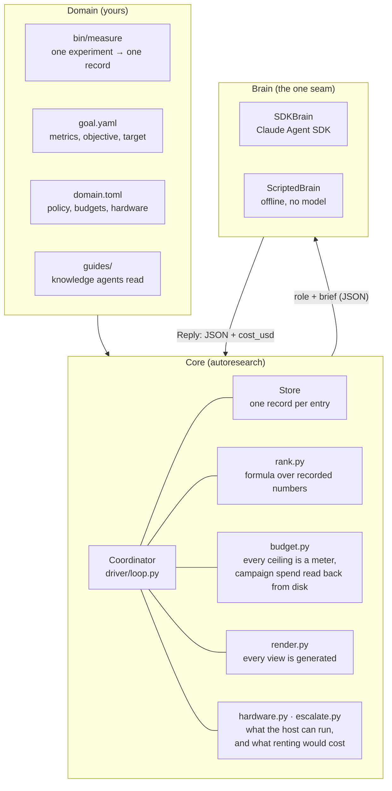
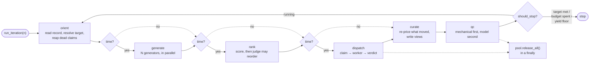
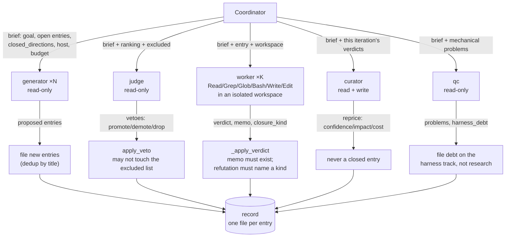
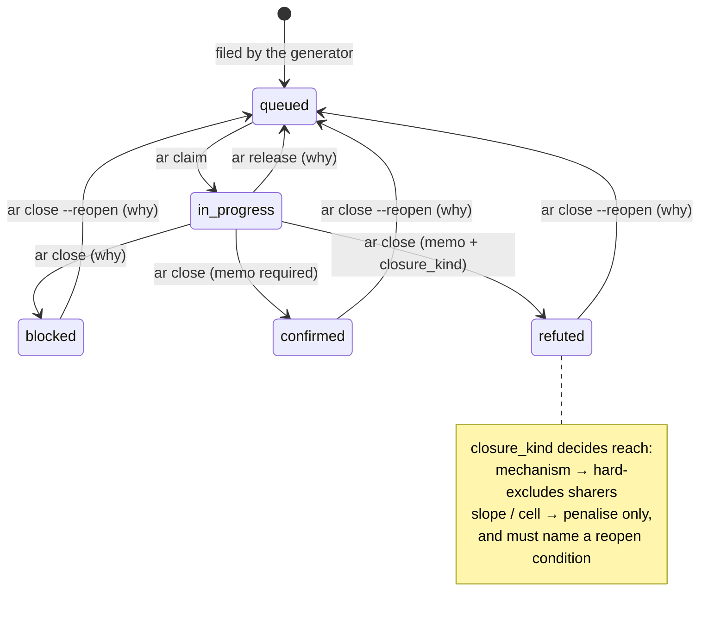
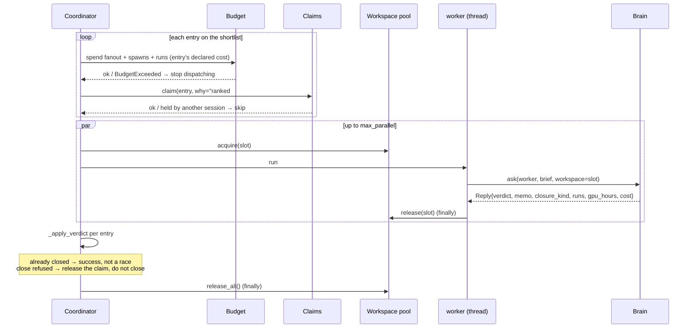

# Architecture

Five diagrams. The first says who owns what; the rest expand one iteration,
the roles inside it, the entry lifecycle, and the worker pool.

Everything here is drawn from `src/autoresearch/driver/loop.py` (the
coordinator), `driver/brain.py` (the model seam), `states.py` (the lifecycle)
and `workspaces.py` (the pool).

## 1. The three layers

A domain supplies measurement, goal, policy and knowledge. Core owns the loop,
the record and every meter. The brain is the one seam judgement passes through,
and it is swappable — which is what makes `ar loop` a unit test rather than a
bill.

Core never calls a model directly and the brain never touches the record: a
role returns JSON, and the coordinator decides what — if anything — that JSON
is allowed to change.

The campaign meters are the ones to watch on the left. `domain.money` and
`domain.gpu_hours` are rebuilt at startup from what the iteration records on
disk already say was spent, not from zero: a campaign ceiling reconstructed
fresh in each process is not a ceiling but a per-invocation allowance, renewable
with the up-arrow.

## 2. One iteration, seven phases

Every phase is metered and records what it *read* and what it *did*, so a phase
that did nothing is distinguishable from a phase that did not run.

Four things about this shape are deliberate:

- **Generate runs every iteration**, concurrently with the work, so the queue
  cannot starve behind a rule that forbids draining it.
- **The coordinator owns the pool.** Teardown is a `finally`, not a runbook.
- **QC is mechanical first.** `ar validate`-style checks answer most of it with
  no model; the QC role is asked only about what code cannot check.
- **Wall clock gates the three phases that start new work.** `generate`, `rank`
  and `dispatch` each ask whether the iteration's `iteration_max_seconds`
  remains before beginning; `curate` and `qc` are not gated, because they close
  out work that has already been paid for. A phase the clock skips is written to
  the record *with its reason* — which is what makes the distinguishability
  claim above true rather than aspirational. The check is made separately before
  each of the three (the dotted edges), not once for the group: an iteration can
  generate, then run out of clock before it dispatches.

Every model call spends a `spawns` meter, QC's included, so the ceiling that
makes a runaway iteration structurally impossible counts every role that ran.

## 3. Roles, and what each may do

Five prompts in `src/autoresearch/agents/`. Only the worker and curator get
write tools; everyone else is read-only.

The right-hand boxes are the enforcement points. A role proposes; the
coordinator is the only thing that writes, and it refuses anything that breaks
an invariant — a close with a missing memo, a veto against a hard filter, a
re-price of a terminal entry.

## 4. An entry's lifecycle

The state machine is total: no status is terminal by omission, every terminal
status has a route back, and every reason-bearing edge demands a reason.

`in_progress` is spelled `in-progress` in the record; Mermaid will not take the
hyphen in a state id.

This is the research track's machine. A track declares its own terminal set and
nothing else about the shape changes — the harness-debt track the toy domain
ships uses `fixed`/`wontfix`/`refuted` in place of `confirmed`/`refuted`, and
gets the same reopen edge on each, because `default_machine` takes the terminal
set as its only parameter.

## 5. Dispatch and the worker pool

Liveness is observed, not inferred: the coordinator submits the work, so it
knows when a worker finished. TTL reaping in `orient` is the fallback for a
holder that died elsewhere.

A worker that raises is recorded as `failed` *against its entry id* — the item
is part of the answer, because a failure that reads as a result is the exact
shape this harness keeps filing defects about.

Two details in the first block are load-bearing. `runs` is spent at *dispatch*,
from the entry's declared cost, not after the worker reports: every card is
dispatched before any of them answers, so a meter charged after the fact bounds
nothing. And `gpu_hours` has to come back through the reply because the rows a
worker wrote live in its own workspace, not in the coordinator's `data/runs` —
the ledger cannot answer that meter alone.
