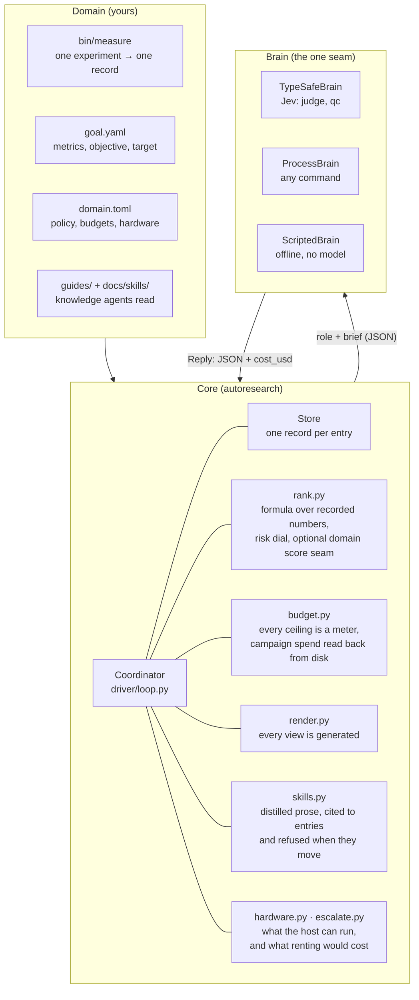
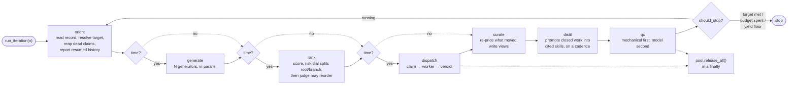
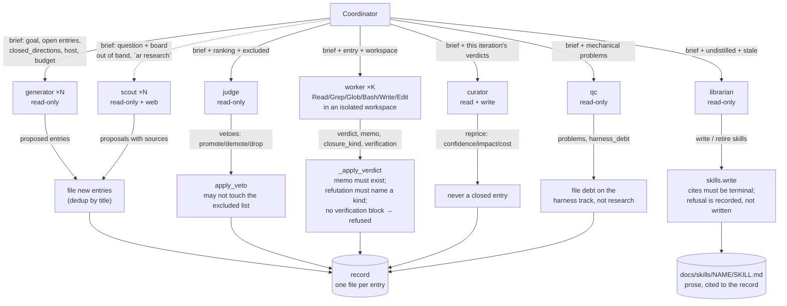
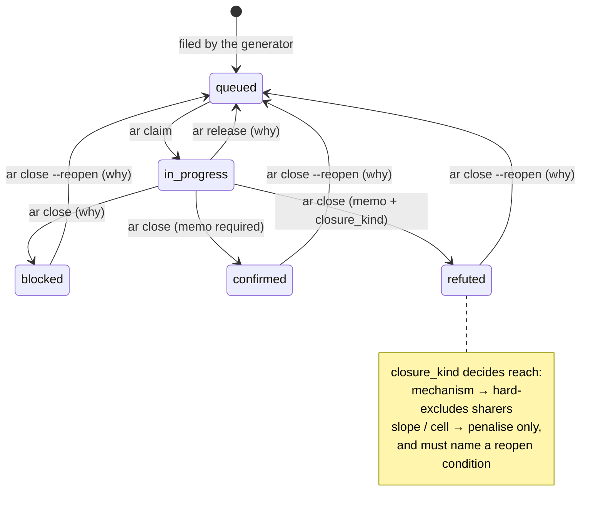
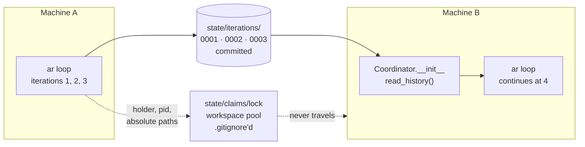

# Architecture

Six diagrams. The first says who owns what; the rest expand one iteration,
the roles inside it, the entry lifecycle, the worker pool, and how a campaign
moves between machines.

Everything here is drawn from `src/autoresearch/driver/loop.py` (the
coordinator), `driver/brain.py` (the model seam), `states.py` (the lifecycle),
`rank.py` (scoring, the risk dial and the domain score seam) and `workspaces.py`
(the pool).

## 1. The three layers

A domain supplies measurement, goal, policy and knowledge. Core owns the loop,
the record and every meter. The brain is the one seam judgement passes through,
and it is swappable — which is what makes `ar loop` a unit test rather than a
bill.



Core never calls a model directly and the brain never touches the record: a
role returns JSON, and the coordinator decides what — if anything — that JSON
is allowed to change.

The campaign meters are the ones to watch on the left. `domain.money` and
`domain.gpu_hours` are rebuilt at startup from what the iteration records on
disk already say was spent, not from zero: a campaign ceiling reconstructed
fresh in each process is not a ceiling but a per-invocation allowance, renewable
with the up-arrow.

## 2. One iteration, eight phases

Every phase is metered and records what it *read* and what it *did*, so a phase
that did nothing is distinguishable from a phase that did not run.



Four things about this shape are deliberate:

- **Generate runs every iteration**, concurrently with the work, so the queue
  cannot starve behind a rule that forbids draining it.
- **The coordinator owns the pool.** Teardown is a `finally`, not a runbook.
- **`distil` is not clock-gated, and sits before `qc`.** Like `curate` it closes
  out work already paid for -- a verdict that never became knowledge is the run
  charged twice -- and putting it ahead of `qc` means the same iteration that
  wrote a skill also checks it. Its cadence is a domain decision
  (`coordinator.distil_every`), and a cadence-skipped phase records *why*, so
  "no cadence" and "nothing to distil" and "the librarian was refused" are three
  distinguishable lines rather than one blank.
- **QC is mechanical first.** `ar validate`-style checks answer most of it with
  no model; the QC role is asked only about what code cannot check. Among the
  mechanical checks since the corpus taught the class: a closed `confirmed`
  entry's typed summary is traced against the run ledger — every non-trivial
  number in it must be a row metric, that row's objective value, the row
  count, or arithmetic over matched values (AgentRxiv's fabricated results,
  arXiv 2503.18102; CodeScientist's unfaithful experiments, arXiv 2503.22708).
- **Wall clock gates the three phases that start new work.** `generate`, `rank`
  and `dispatch` each ask whether the iteration's `iteration_max_seconds`
  remains before beginning; `curate` and `qc` are not gated, because they close
  out work that has already been paid for. A phase the clock skips is written to
  the record *with its reason* — which is what makes the distinguishability
  claim above true rather than aspirational. The check is made separately before
  each of the three (the dotted edges), not once for the group: an iteration can
  generate, then run out of clock before it dispatches.

Every model call spends a `spawns` meter, QC's included, so the ceiling that
makes a runaway iteration structurally impossible counts every role that ran.

The rank phase is where the search becomes a **tree**. Every entry carries a
`parent`: a branch off work already in the record (the child refines, narrows,
or re-runs its parent with one premise exchanged) or a novel root. The
coordinator owns the structure — an unknown parent, a lineage deeper than
`tree_max_depth`, more siblings per parent than `tree_max_children`, or a
branch crossing tracks is refused at filing, with a reason, in the generate
phase's detail lines. The shortlist splits on the same field:
`[coordinator] risk` (default 0.5 — the neutral 50/50 stance between improving
the incumbent and opening new territory) decides what share of the slots goes
to roots; within each partition the score decides; an unfilled share returns
to the other partition; `k=1` is never spent on a partition. Another hard
filter guards yield: with `branch_stagnation` set, a parent whose children
closed `refuted` at least that many times without a single `confirmed` is
stagnant — its remaining children are excluded from ranking and a new child
is refused at filing. The exclusion is recomputed from the record every rank,
so one confirmed sibling clears it. A domain may
replace the formula's pricing with its own through `[commands] score =
"bin/score"` — a seam shaped like `preflight` (stdin `{"risk", "entries"}`,
stdout `{"scores": [{id, score, reason}]}`, claimable candidates only). The
hard filters run before the seam either way, so neither the dial nor a
domain's prices can resurrect a `mechanism`-refuted direction or a stagnant
lineage; and a seam
failure refuses the rank phase and skips dispatch rather than falling back to
the formula the domain replaced.

## 3. Roles, and what each may do

Seven prompts in `src/autoresearch/agents/`. Only the worker and curator get
write tools; everyone else is read-only -- the librarian included, deliberately:
it returns a skill body and the coordinator writes it, so no role certifies its
own output.



The right-hand boxes are the enforcement points. A role proposes; the
coordinator is the only thing that writes, and it refuses anything that breaks
an invariant — a close with a missing memo, a veto against a hard filter, a
re-price of a terminal entry.

## 4. An entry's lifecycle

The state machine is total: no status is terminal by omission, every terminal
status has a route back, and every reason-bearing edge demands a reason.



`in_progress` is spelled `in-progress` in the record; Mermaid will not take the
hyphen in a state id.

This is the research track's machine. A track declares its own terminal set and
nothing else about the shape changes — the harness-debt track the toy domain
ships uses `fixed`/`wontfix`/`refuted` in place of `confirmed`/`refuted`, and
gets the same reopen edge on each, because `default_machine` takes the terminal
set as its only parameter.

## 5. Dispatch and the worker pool

Liveness is observed, not inferred: the coordinator submits the work, so it
knows when a worker finished. TTL reaping in `orient` is the fallback for a
holder that died elsewhere.

Before allocating each selected entry, dispatch checks the measurement command
against the domain's human-only policy. An optional `[commands].preflight`
command then receives `{"entry": <entry record>}` on stdin, in the domain root.
It runs as shell-free argv with a 10-second timeout and must exit zero with
one JSON object containing `feasible` (boolean) and `reason` (string).
A false result needs a nonempty reason. Policy refusal, timeout, nonzero exit
or malformed output records a blocked verdict and skips the card without
spending dispatch resources or creating a claim/workspace. Domains without a
hook retain existing behavior after the measurement-command policy check.
The hook is domain-owned and must be read-only; this is not a sandbox or a
substitute for native-agent permission checks.

**Replication at the close boundary.** `[coordinator] confirm_runs` (default 1)
demands that many valid run rows in the ledger before a `confirmed` experiment
closure is accepted — on both close paths (`_apply_verdict` and `ar close`),
so neither can bypass the other's guard. A short ledger refuses the close and
releases the claim back to the queue; `refuted` verdicts are exempt, because a
legitimate refutation may hold only `invalid`/`failed` rows and demanding
clean rows for a `no` would cry wolf. This is per-entry replication, weaker
than the goal-level `confirm_independently` (different session or entry), and
the two guard different threats: one noisy run closing a discovery versus a
proxy overfitting across claims.

```mermaid
sequenceDiagram
    participant C as Coordinator
    participant B as Budget
    participant Cl as Claims
    participant P as Workspace pool
    participant W as worker (thread)
    participant Br as Brain

    loop each entry on the shortlist
        C->>C: policy + optional domain preflight; blocked → skip card
        C->>B: spend fanout + spawns + runs (entry's declared cost)
        B-->>C: ok / BudgetExceeded → stop dispatching
        C->>Cl: claim(entry, why="ranked #k")
        Cl-->>C: ok / held by another session → skip
    end

    par up to max_parallel
        C->>P: acquire(slot)
        C->>W: run
        W->>Br: ask(worker, brief, workspace=slot)
        Br-->>W: Reply{verdict, memo, closure_kind, runs, gpu_hours, verification, cost}
        W-->>C: reply + pinned slot + inherited ledger snapshot
    end

    C->>C: harvest new run rows, outputs and memo serially
    Note over C: missing/colliding evidence → refuse verdict, retain slot<br/>successful harvest → release slot
    C->>C: _apply_verdict per entry
    Note over C: already closed → success, not a race<br/>no verification block → refused, claim released<br/>close refused → release the claim, do not close
    C->>P: release_all() (finally)
```

A worker that raises is recorded as `failed` *against its entry id* — the item
is part of the answer, because a failure that reads as a result is the exact
shape this harness keeps filing defects about.

Two details in the first block are load-bearing. `runs` is spent at *dispatch*,
from the entry's declared cost, not after the worker reports: every card is
dispatched before any of them answers, so a meter charged after the fact bounds
nothing. After each worker returns, new rows and declared findings are retained
in the coordinator's configured ledger before its workspace is removed.
Missing evidence refuses a measured verdict and leaves the workspace pinned
for inspection, while reported consumption is still charged conservatively.
`run_ids` on each iteration identifies retained rows so restarting does not
charge them twice; historical iterations without IDs remain conservative.
GPU-hours use the greater of worker-reported consumption and retained row cost.
Consumption is attributed to the original claim instance in `runs_by_entry`,
with its session and `claim_at` timestamp captured before dispatch. `ar budget`
matches both fields; resolved claims must not charge a later same-session
claim. Legacy attribution without a timestamp remains part of campaign
consumption but cannot be assigned to a current claim. Direct ledger rows are
counted only when their start time falls within the current claim.

## 6. Resuming on another machine

The coordination primitives are single-filesystem, so two machines working in
parallel is not supported. *Sequential* handoff is, and it turns on one thing:
`state/iterations/` is read as well as written.



Three consequences, each of which was a defect before it was a design:

- **Numbering continues from the highest record**, and reusing a recorded number
  is refused *before* any phase runs rather than at record time, when the fanout
  has already been spent. Numbering from zero in each process overwrote the
  previous session's audit trail — silently, and by the session resuming it.
- **`yield_floor` needs history to work at all.** The third exit wants
  `over_iterations` samples of confirmed-per-iteration; seeing only the current
  process's, it never fired under `--iterations 1`.
- **The claim lock and the workspace pool never travel.** They name a holder, a
  pid and absolute paths that mean nothing on the other machine, so the findings
  lane enumerates `state/entries` and `state/iterations` rather than taking
  `state/` whole.
